영상: [CSA2021 컴퓨터시스템구조](https://www.youtube.com/playlist?list=PLc8fQ-m7b1hCHTT7VH2oo0Ng7Et096dYc)

## 강의 소개
- 컴퓨터 공학의 교육과정의 핵심은 컴퓨터 구조, 프로그래밍 언어, 운영체제이다. 

- 세 분야의 유사도는 75%로 아주 높으며, 하나라도 놓치면 다른 영역도 이해하기가 매우 어렵다 

- 컴퓨터 구조

  - **컴퓨터 구조**(computer architecture)는 [컴퓨터 과학](https://ko.wikipedia.org/wiki/컴퓨터_과학)에서 컴퓨터 시스템의 기능(functionality), 조직(organization), 구현(implementation)에 대한 법칙과 방법을 통칭한다. 또 다른 정의로는 컴퓨터 구조는 [명령어 집합 구조](https://ko.wikipedia.org/wiki/명령어_집합)(Instruction set architecture, ISA), [마이크로아키텍처](https://ko.wikipedia.org/wiki/마이크로아키텍처)(Microarchitecture) 설계, 논리 설계 및 [구현](https://ko.wikipedia.org/wiki/구현)을 의미한다.

- 프로그래밍 언어

  - **프로그래밍 언어**는 [컴퓨터](https://ko.wikipedia.org/wiki/컴퓨터) 시스템을 구동시키는 [소프트웨어](https://ko.wikipedia.org/wiki/컴퓨터_소프트웨어)를 작성하기 위한 형식언어이다. [고급 언어](https://ko.wikipedia.org/wiki/고급_프로그래밍_언어)일수록 사람이 사용하는 언어에 가깝다.

    일반적으로 말할 때에는 프로그래밍 언어를 지원하는 소프트웨어, 곧 소프트웨어를 작성하기 위한 소프트웨어를 가리키는 때가 많고, 이때에는 프로그래밍 언어와 소프트웨어를 구분하지 않고 소프트웨어를 프로그래밍 언어로 보기도 한다.

- 운영체제

  - **운영 체제**또는 **오퍼레이팅 시스템**(operating system, [약칭](https://ko.wikipedia.org/wiki/약칭): OS)은 사용자의 [하드웨어](https://ko.wikipedia.org/wiki/하드웨어), [시스템 리소스](https://ko.wikipedia.org/wiki/시스템_리소스)를 제어하고 [프로그램](https://ko.wikipedia.org/wiki/컴퓨터_프로그램)에 대한 일반적 서비스를 지원하는 [시스템 소프트웨어](https://ko.wikipedia.org/wiki/시스템_소프트웨어)이다. 시스템 하드웨어를 관리할 뿐 아니라 [응용 소프트웨어](https://ko.wikipedia.org/wiki/응용_소프트웨어)를 실행하기 위하여 하드웨어 추상화 플랫폼과 공통 시스템 서비스를 제공한다. 최근에는 [가상화](https://ko.wikipedia.org/wiki/가상화) 기술의 발전에 힘입어 실제 하드웨어가 아닌 [하이퍼바이저](https://ko.wikipedia.org/wiki/하이퍼바이저)(가상 머신) 위에서 실행되기도 한다.

## [제 1장 Part-1](https://www.youtube.com/watch?v=SG89LOgT7Vc&list=PLc8fQ-m7b1hCHTT7VH2oo0Ng7Et096dYc&index=2)

### 디지털 컴퓨터(Digitial Computer)

- 정의

  - 이진 시스템(0,1)을 사용하는 계산을 수행하는 디지털 시스템
  - 비트(0과 1의 조합)의 그룹을 사용하여 숫자, 문자 및 기타 정보를 표시하거나 처리

- 컴퓨터 하드웨어

  - CPU - 중앙처리 장치. 컴퓨터 그 자체로 정의. 산술 논리 처리와 데이터의 저장, 제어 기능 수행
    - Centeral Processing Unit
    - 컴퓨터 과학에서는 컴퓨터 자체를 CPU로 이야기하는 경우가 많다. 

  - 주변장치 - 메모리(RAM/ROM), 저장 장치(Storage), 입출력 장치(IO devices)

- 컴퓨터 소프트웨어

  - 운영체제
    - OS- Operating System

  - 시스템프로그램
    - 유틸리티, 데이터베이스, Editor
      - 시스템 프로그램은 운영체제가 만들어질때부터 설계되는 것이기 때문에 MS word나 아래한글은 포함되지 않는다. 응용프로그램에 포함된다. 
      - Window에서는 노트패드, Unix에서는 Vi를 의미 

    - OS에 포함되거나 연결되어 시스템 운영을 보조

  - 응용 프로그램
    - 게임, 웹, MsWord 등 

- 디지털 컴퓨터의 블럭 구성도

  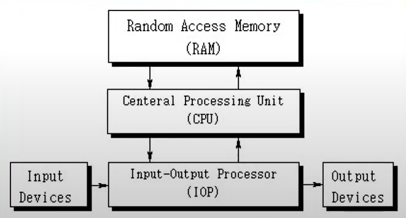

### 논리 게이트(Logic Gates)

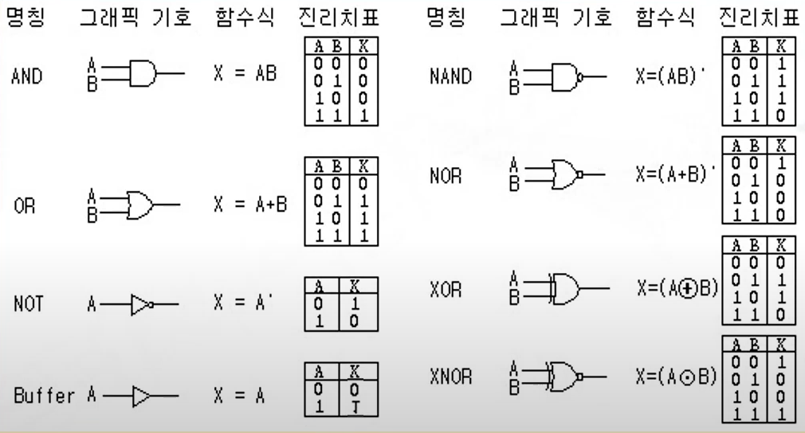

- 명칭 설명
  - AND - 둘중 하나라도 0이명 0이다.
  - OR - 둘중 하나라도 1이면 1이다. 
  - NOT - 신호가 들어오면 그 신호의 반대신호를 출력한다. 
  - Buffer - 들어오는 신호를 출력한다. 
  - NAND - AND 게이트에 Not을 붙인 것 , AND와 반대의 출력을 보임
  - NOR-  OR 게이트에 Not을 붙인 것, OR와 반대의 출력을 보임
  - XOR - 서로 같은 입력이 들어오면 0 , 서로 다른 입력이 들어오면 1을 출력
  - XNOR - 서로 같은 입력이 들어오면 1, 서로 다른 입력이 들어오면 0을 출력

- 이진 정보의 표시
  - 0과 1의 전압 신호
  - (0V - 5V) 시스템
  - (0.5V - 3V) 시스템
- 논리 게이트
  - 기본 게이트
  - 진리표로 동작 정의 

### [부울 대수(Boolean Algebra)](/이산-수학/명제,추론,귀납,부울대수/부울-대수.md)

- 이진 변수와 논리 동작을 취급하는 대수
- 기본 대수 동작 : AND, OR, NOT 
- 부울 대수의 예 
  - F = x+y`z 
    - Y에 not을 붙이고 z와 and를 붙인 값을 x와 or시킨다. 

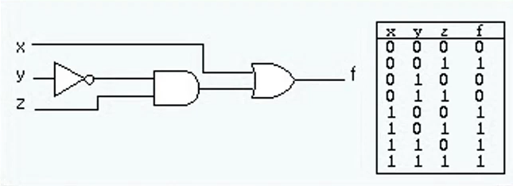

- 부울 대수의 사용 이유

  - 변수 사이의 진리표 관계를 대수적으로 표시
  - 논리도의 입출력 관계를 대수 형식으로 표시
  - 같은 기능을 가진 더 간단한 회로의 발견

- 부울 대수의 기본 관계 

  - 항등원
  - 역원
  - 교환법칙
  - 결합법칙
  - 드모르 강의 법칙 

  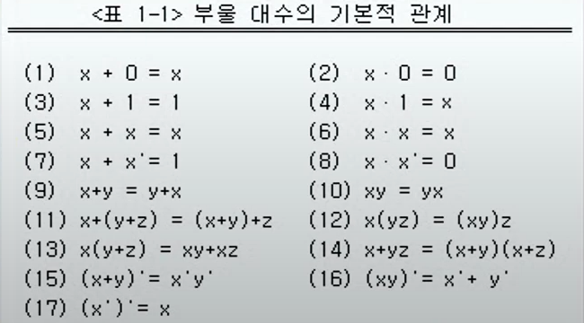

- 부울 대수의 간략화와 등가 회로

  - F = ABC + ABC' + A'C = AB(C+C') + A'C
  - 기존 회로는 ABC를 and하고 AB'C를 and하고 A'C를 or했어야한다. 
  - 하지만 바뀐 회로는 

  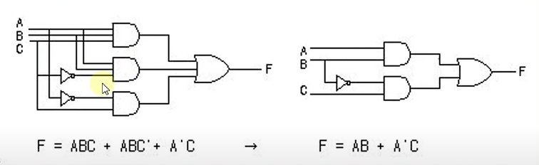

- 부울 대수의 보수
  - F = AB + C'D + B'D 
  - F' = (A'+B')(C+D)(B+D)

### 맵의 간소화 (Karnaugh Map)

- 부울 함수를 Visual Diagram을 통하여 간소화
- Karnaugh map, Veitch diagram
- Minterm, Maxterm을 이용한 간소화

- 논리합의 논리곱
  - 1항의 간소화
  - 0항의 간소화
- 무정의 조건
  - 사용하지 않는 항을 활용하여 간소화
    - F=(A,B,C ) = sum(0,2,6)
    - d(A,B,C) = sum(1,3,5)

- [4강 동치 관계](/이산-수학/이산수학-기초/동치-관계.md)

## [제 1장 Part-2](https://www.youtube.com/watch?v=gn5z3Un_qqM&list=PLc8fQ-m7b1hCHTT7VH2oo0Ng7Et096dYc&index=3)

### 조합회로 (Combinational Circuit)
- 정의
  - 입력과 출력을 가진 논리 게이트의 집합
  - 출력의 값은 입력의 0,1의 조합에 의하여 결정되는 함수의 결과로 표시
  - n개의 입력 조합이 있을 경우 간으한 입력 조합 : 2^n가지 
- 조합 회로의 설계 절차
  1. 해결할 문제의 제시
  2. 입력과 출력의 변수에 문자 기호 부여 
  3. 입력-출력 관계를 정의하는 진리표 도출
     - 어떤 입력이 들어오면 어떤 출력이 나온다
  4. 각 출력에 대한 간소화된 부울 함수 도출
     - 가급적이면 어떤 진리표가 나올 때 카르노맵을 사용해 간단한 부울 수식을 만들면 좋음 
  5. 부울 함수에 대한 논리도 작성
  6. 논리도를 바탕으로 회로 구현 

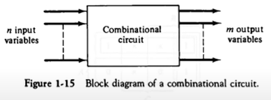

- 반가산기

  - 2개의 비트값을 산술적으로 가산 
  - S (sum)= x'y + xy' = x xor y
  - C(캐리) = xy
  - C는 자리 올림수 S 는 합  

  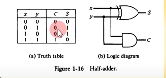

  - 0과 0의 합은 0, carry = 0 
  - 0과 1의 합은 1, carry = 0 
  - 1과 0의 합은 1, carry = 0
  - 1과 1의 합은 0, carry =1

- 전가산기

  - 캐리 값을 포함하여 3비트 가산
    - S = x xor y xor z
    - C = xy + (x xor y)z 

  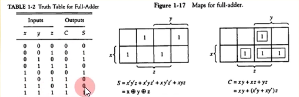

### 플립플롭 (Flip-Flop)
- 플립플롭의 정의
  - 1 비트의 디지털 정보를 저장하는 이진 셀(디지털 메모리)
  - 동기식 순차회로의 기본적인 요소로 사용, 조합회로와 함께 순차회로를 구성
  - 입력의 상태가 변화를 일으키기 전까지는 이전의 출력상태를 그대로 유지

- 플립플롭의 종류
  - SR-플리플롭
    - S값과 R값에 변화가 있더라도 Clock이 들어오기 전까지 Q값의 변화는 없다. 
    - S와 R 값이 둘다 1인 경우에는 출력값이 정해지지 않는다. 
    - SR플리플롭은 S와 R이 둘다 1이 되지 않도록 주의할 필요가 있다. 

  - D-플리플롭
    - D와 Clock이 들어오면 실행되는데, D가 0이면 출력은0, D가1이면 출력은 1 

  - JK-플리플롭
    - J/K가 둘다 0이면 출력이 그대로 0(SR플리플롭과 동일)
    - J/K가 둘다 1이면 현재 Q출력의 반대 출력 즉, Not Q가 출력됨 

  - T-플리플롭
    - J/K 플리플롭의 단순 형태로, T가 0이면 이전의 값, T가1이면 이전 출력값의 반대를 출력한다. 
    - 토글 플리플롭이라고도 이야기한다. 

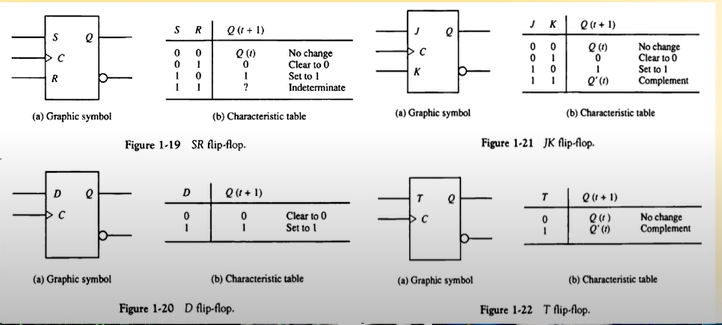

- 모서리-변이형 플리플롭(Edge-triggered FF)

  - 클럭의 동작을 의미 

  - 입력값의 변화 모서리에서만 동작

    - Upward triggered FF
      - 입력값이 상향일 경우에만 동작 (0->1)
    - Downward triggered FF
      - 입력값이 하향일 경우엠나 동작(1->0)

  - 올바른 동작을 위해서는 최소의 신호 유지 시간 필요

    - Setup time
      - 출력 변화를 위하여 입력이 유지되어야 하는 최소의 시간
    - Hold time
      - 출력 유지를 위하여 입력이 바뀌지 않아야하는 최소 시간

    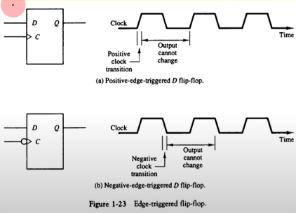

### 순차회로 (Sequential Circuit)
- 정의
  - 플립플롭과 게이트 (또는 조합회로)를 서로 연결한 회로
  - 클럭펄스에 의하여 동기화된 입력 순차에 의하여 제어
  - 출력은 외부 입력과 플립플롭의 현 상태의 함수로 표시
- 플립플롭의 출력이 그냥 나가는 것이 아니라 다시 조합회로의 입력으로 들어가서 input이 바뀐다 한다고, 반드시 전의 input에 대한 출력이 나오라는 보장은 없다. 

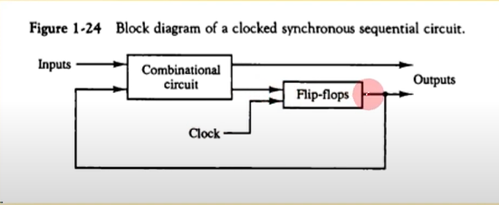

- 플립플롭의 입력식

  - FF의 입력을 만들어내는 조합 회로 부분

  - 부울 수식에 의하여 표현

  - 상태표(State Table)

    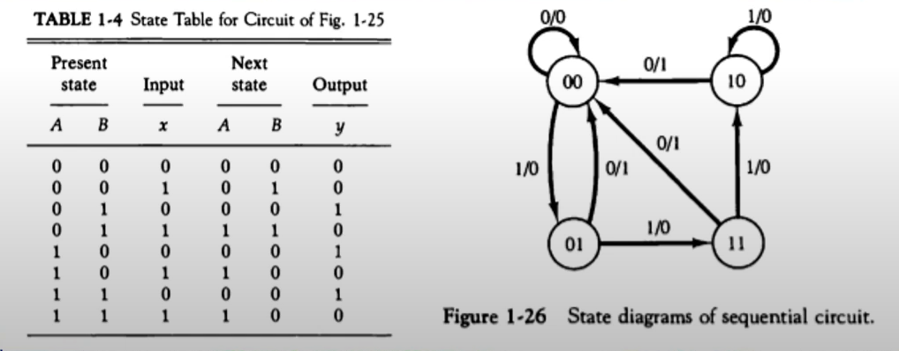

  - 상태도(State Diagram)

    - DA = Ax + Bx
    - DB = A'X
    - y = AX' + BX'

    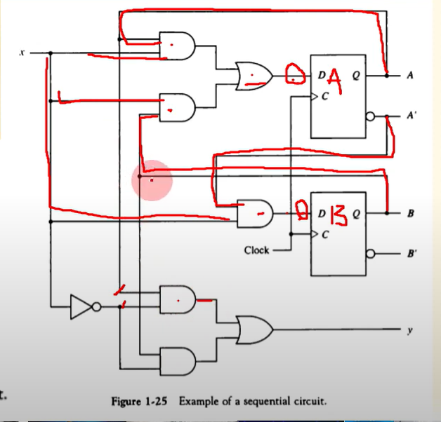

- 순차회로 설계

  - 2비트 2진카운터의 설게

    1. 상태표, 상태도 작성

       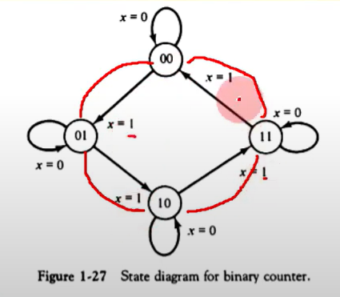

    2. 순차회로 여기표 작성

    3. 플립플롭의 선택과 입력식 도출

    4. 회로도 구현 

    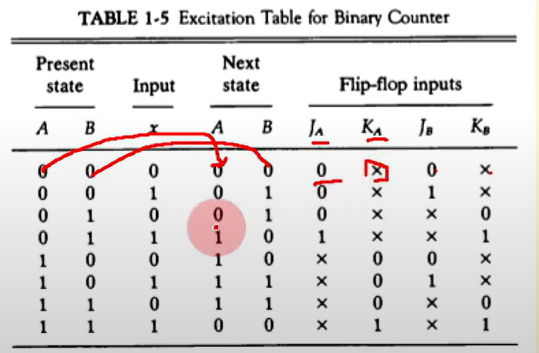