## [제 3장 Part-1](https://www.youtube.com/watch?v=aSocCv3SC2k&list=PLc8fQ-m7b1hCHTT7VH2oo0Ng7Et096dYc&index=6)

### 데이터의 종류 (Data Types)

#### 컴퓨터 레지스터에서 쓰이는 데이터 종류

- 산술 연산용 숫자 (Numeric)
- 데이터 처리용 영문자 (Alpha) ,52자 
- 특수 목적용 기호(Special), 

#### 진수와 진법

**radix : 진법의 기수에 해당 (10, 2, 8, 16)**

- 10진수
  - 724.5 = 7x10^2 + 2x10^1 + 4x10^0 + 5x10^-1
- 2진수
  - 101101  = 1x2^5 0x2^4 + 1x2^3 + 1x2^2 + 0x2^1 + 1x2^0 = 45
- 8진수
  - 736.4 = 7x8^2 + 3x8^1 + 6x8^0 + 4x8^-1 = 478.5
- 16진수
  - F3 = Fx16^1 + 3x16^0 = 243

- 2진화 8진수 (Octal)

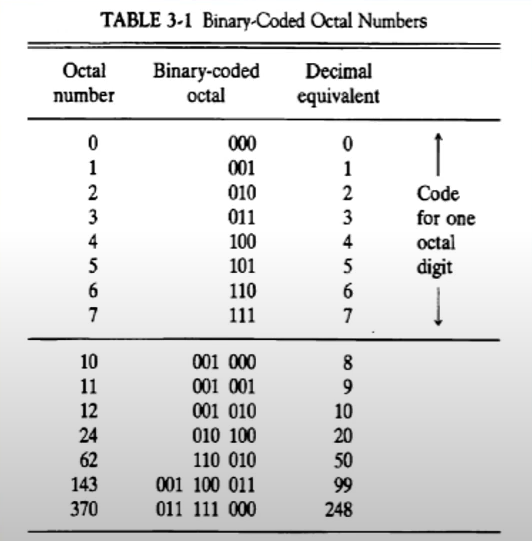

- 2진화 16진수 (Hexadecimal)

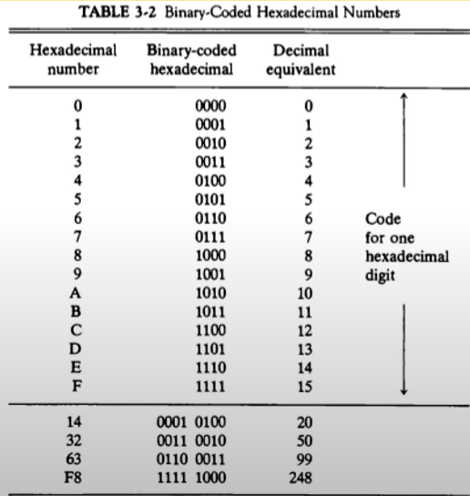

- 2진화 10진수 (BCD : Binary Code Decimal)

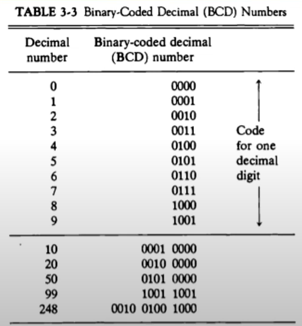

#### 영숫자(AlphaNumeric)의 표시

- ASCII(American Standard Code) Code : 7bits(+1 parity bit),
- EBCDIC Code : 16bits, IMB internal code
- UniCode : 16bits/32bits

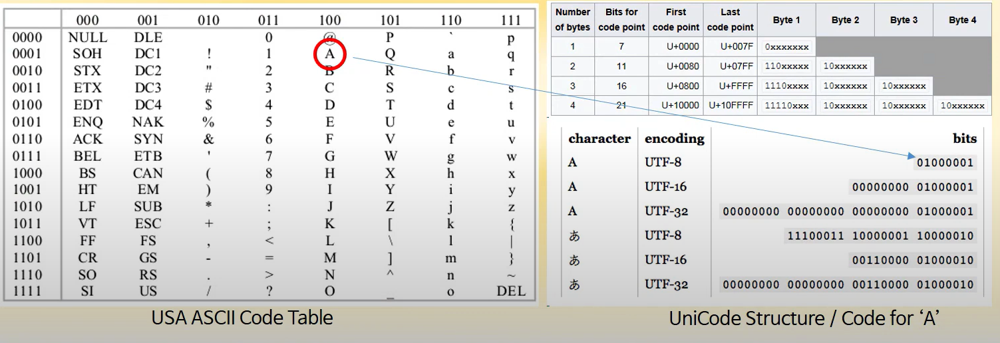

#### Special Communication Data

- Morse code

- Flag Signal(Red/White flags)

### 보수 (Complements)

#### 정의

- 진법의 기수 ra대응하는 역(reverse) 값
- 뺄셈과 논리 계산에 사용

#### (r-1)의 보수 체계

- 9's complement 9999 - 12389 = 87610
- 1's complement 1111111 - 0001111 = 1110000

#### (r)의 보수 체계 

- 10's complement 100000 - 12389 = 87611
- 2's complement = 10000000 - 0001111 = 1110001

#### 부호 없는 숫자의 뺄셈

- 72532 - 13250 = 59282

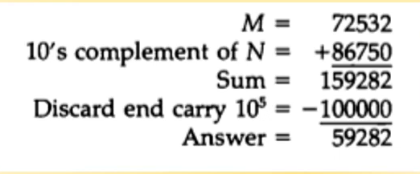

- 13250-72532 = -40728

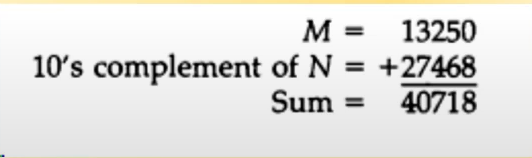

- 부호없는 2진수의 뺄셈

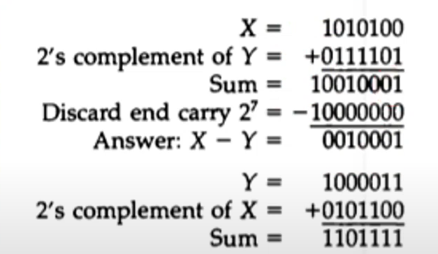

## [제 3장 Part-2](https://www.youtube.com/watch?v=bysGzutpRgc&list=PLc8fQ-m7b1hCHTT7VH2oo0Ng7Et096dYc&index=7)

### 고정 소수점 표현 (Fixed Point Representation)

#### 정의

- 소수점의 위치를 결정하여 숫자 표현
- 레지스터 비트에 소수점 위치를 표시

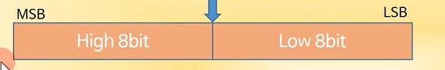

- 16bit 정수의 경우 최우측(LSB)에 소수점 자리 위치
- 부동소수점의 경우, 레지스터 비트 앞/중간에 소수점 자리 위치

#### 정수의 표현 (-14)

- MSB(Most Significant Bit)로 부호 표현
- 양수는 MSB -> 0, 음수는 MSB -> 1

- 부호는 절대값 표현 (Signed magnitude )    1 0001110
- 부호화된 1의 보수(signed 1's complement)   1 1110001
- 부호화된 2의 보수(signed 2's) complement)     1 1110010
  - 대부분의 컴퓨터 , CPU에서 사용 (Intel, AMD, Zilog )

####  산술 가산(Arithmetic add)

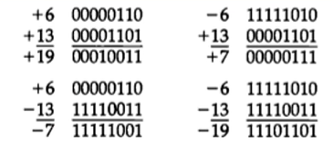

#### 산술 감산(Arithmetic substact)

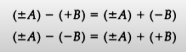

#### 오버플로우 

##### 오버플로우의 발생

- N자리의 두 수를 더하여 N+1자리의 합이 발생하였을 때. 
- 가수, 피가수의 부호와 관계없이 발생
- 정해진 레지스터의 비트수로 인한 문제
  - 종이와 연필로 연산할 경우 절대 발생되지 않을 상황
  - 정해진 비트 수내에서만 연산이 가능한 컴퓨터에서 발생

##### 오버플로우 발생 상황

- 연산 결과값이 레지스터의 비트수를 초과할 경우 발생
- 두 수의 부호가 같을 경우에만 발생
- 레지스터에 저장된 연산 결과값은 잘못된 값으로 저장

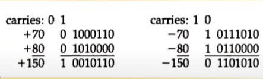

##### 오버플로우 처리 방법

- 오버플로우의 발생을 미리 확인
  - MSB의 두 캐리 비트의 값이 서로 다르면 오버플로우
  - `if C_8 xor C_7 = 1`,Overflow occurs
  - 각 자리수의 연산을 했을 때 생기는 carry 들 중에서 C7과 C8의 결과가 다르면 오버플로우이다. 

- 연산을 처리하지 않고 인터럽트 또는 에러 처리 

### 부동 소수점 표현 (Floating Point Representation)

#### 부동소수점 표시 방법(IEEE 754)

- 가수와 지수로 표현
- 가수(mantissa) : 분수(Fraction), 정수값 표시
- 지수(Component) : 십진/이진 소수점 위치를 표현 

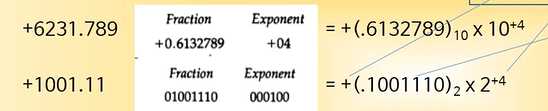

#### 정규화

- 부동소수점 숫자에서 최상위 비트가 0이 아닌 경우
- 0이 있을 경우, Mantissa의 소수점 위치 이동
- 이동한 만큼 exponent 값 변경

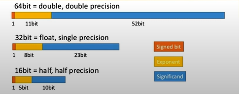

### 기타 이진 코드 (Other Binary Codes)

#### Grey Code

- 한 숫자에서 다음 숫자로 변할 때 한 비트만 변동
- 제어 계통에 주로 사용
- 여러 전기 신호가 동시에 바뀔 때 낮은 에러 발생률

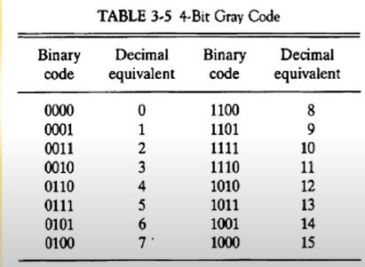

#### BCD Code

- 10진수에 대한 2진수 표현 
- 4bit를 사용 0~9까지 사용

#### Excess-3 Code

- BCD Code + 0011
- 암호 교신의 기본 코드, 파생 암호 발생 방법에 사용

#### 기타 영문 code

- ASCII : 7bits + parity 1bit
- EBCDIC : 8bits + parity 1bit

### 에러 검출 코드 (Error Detection Codes)

#### Parity bit

- 외부 잡음에 의한 에러 발생의 검출
- 짝수(Even) 패리티/ 홀수(odd) 패리티 사용
- 가장 간단하고도 일반적인 방법
- 2개의 비트 동시 에러의 경우 검출 불가능

#### Parity bit의 적용

- 송신측 : 패리티 발생기

- 수신측 : 패리티 검사기

- 수신측 패리티 검사 결과

  - 데이터 패리티와 일치 -> 에러 없음 (0 출력)

  - 데이터 패리티와 불일치 -> 에러 발생(1 출력 )

- 0의개수가 짝수개이면 odd 1 0의 개수가 홀수개이면 even 1 

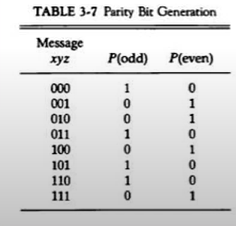