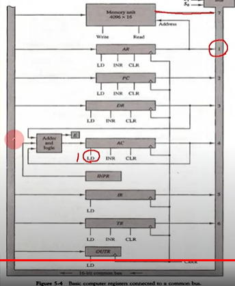
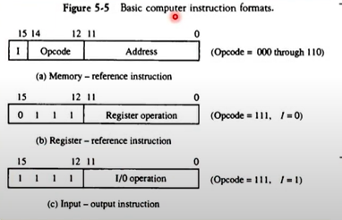
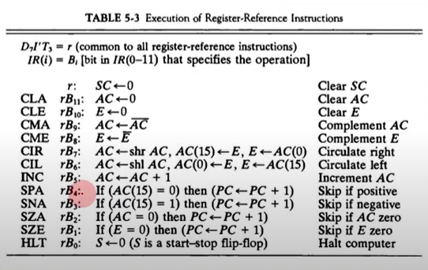
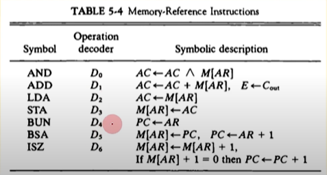
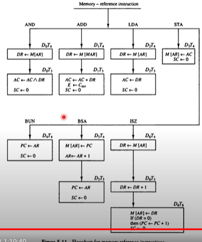

## [제 5장 Part-1-1](https://www.youtube.com/watch?v=vSnpYzCuwVY&list=PLc8fQ-m7b1hCHTT7VH2oo0Ng7Et096dYc&index=10)

### 명령어 코드 (Instruction Codes)

#### 컴퓨터의 동작

- 레지스터 내에 저장된 데이터에 대한 마이크로 연산의 시퀀스에 의하여 정의
- 범용 컴퓨터 시스템에서는 다양한 마이크로 연산 시퀀스를 정의

#### 명령어 코드

- 컴퓨터에게 어떤 특별한 동작을 수행할 것을 알리는 비트들의 집합
- 연산 코드들로 구성

#### 컴퓨터 명령어

- 컴퓨터에 대한 일련의 마이크로 연산을 기술
- 이진 코드로 구성
- 데이터와 함께 메모리에 저장

#### 프로그램

- 사용자가 원하는 연사놔 피연산자가 처리되는 순서를 기술한 컴퓨터 명령어의 집합

#### 내장 프로그램

- 제어 신호에 의하여 명령어의 이진 코드를 해석하여 실행
- 명령어를 저장하여 실행하는 컴퓨터 구동 방시 

#### 저장 프로그램 구조

- 명령어의 집합으로 구성
- 각 명령어는 명령여 포맷에 따라서 정의
- 프로그램 실행 부분에 따라서 메모리의 다른 부분에 저장
- 명령어 실행 결과는 AC에 저장 
- 컴퓨터 레지스터 (Computer Registers)

#### 간접주소 시스템

- 많은 경우, 직접주소를 사용하여 데이터 지정
- 필요한 경우, 간접 주소로 데이터 지정 

#### 기본 컴퓨터의 레지스터

- 기본 컴퓨터란 ? 
  - DEC PDP- 11 Mini computer
  - 가상의 컴퓨터가 아닌 실제 제품
  - 1980년대 주력 메인프레임급
  - 최신의 CPU도 기본적으로 동일한 구조 

### 컴퓨터 레지스터

#### 버스 시스템의 종류

- 내부 버스
  - CPU 내부 레지스터간 연결
- 외부 버스
  - CPU 내부 레지스터 - 메모리간 연결
- 입출력 벅스
  - CPU <-> 주변장치 (I/O) 연결

#### 공통 버스 시스템

- 레지스터 출력은 버스의 MUX 입력에 연결
- 각 레지스터에 MUX 입력번호 설정됨
- 레지스터 입력은 버스에 직접 연결(LD로 제어)
- S2, S1, S0에 의하여 레지스터 출력 결정

#### 버스의 동작

- DR <- AC, AC<-DR
- M[AR] <-DR
- AR <- PC

#### MUX Inputs

1. AR
2. PC
3. DR
4. AC
5. DR
6. TR
7. Memory

#### 공통 버스 시스템

- 내부 버스를 통칭 
- 내부 버스의 크기로 CPU 워드 크기 결정
  - 16bit 컴퓨터 - 내부 버스/레지스터 크기가 16bit
  - 32bit 컴퓨터 - 내부 버스/레지스터 크기가 32bit
- 전송 연결 통로
  - 레지스터 - 레지스터 데이터 전송 통로
  - 레지스터 - 메모리 데이터 전송 통로 (예외적 표현)
  - 한순간에는 하나의 전송 신호만이 버스에 존재 가능 

## [제 5장 Part-1-2](https://www.youtube.com/watch?v=T2oKxvinK84&list=PLc8fQ-m7b1hCHTT7VH2oo0Ng7Et096dYc&index=11)

### 컴퓨터 명령어 (Computer Instructions)

#### 기본 컴퓨터 명령어의 종류

- MRI 명령 7가지 
- RRI 명령 12가지
- IO 명령 6가지 

#### 명령어 포맷 

- 

### 타이밍과 제어 (Timing and Control)

#### 명령어 실행 타이밍

### 명령어 사이클 (Instruction Cycle)

#### 명령어 사이클 단계

1. 메모리에서 명령어 가져오기 (Fetch)
2. 명령어 디코딩
3. 유효주소(Effective Address) 계산
4. 명령어 실행

#### Fetch와 Decode 

- T0 : AR <- PC 
  - MUX 2 open, LD AR
- T1 : IR <- M[AR], PC <- PC+1
- T2 : D0...D7 <- decode IR(12-14),  AR <- IR(0-11), I <- IR(15) 
  - MUX 5 open, LD AR

#### 명령어의 조율 결정

- MIR 명령어 여부
- RRI 명령어 여부
- IO 명령 결정

#### 레지스터 참조 명령어의 종류와 동작

### 메모리 참조 명령어 (Memory-Reference Instuctions)

#### AND

- D0T4 : DR <- M[AR]
- D0T5 : AC <- AC ^ DR, SC <-0 

#### ADD 

- D1T4 : DR <-M[AR]
- D1T5 : AC <- AC + DR, E<- Cout SC<-0

#### LDA

- D2T4 : DR <- M[AR]
- D2T5 : AC <- DR, SC <-0

#### STA

- D3T4 : M[AR] <- AC, SC<>-0

#### BUN

- D4T4 : PC <- AR, SC <-0

#### BSA

- 함수, 서브루틴의 구현에 사용
- 간접주소 사용의 전형적인 예
- D5T4 : M[AR] <- PC, AR <- AR +1 
- D5T5 : PC <- AR, SC <-0 

#### ISZ

- Loop 제어문 구현에 사용 (for, while )

- D6T4 : DR <- M[AR]

- D6T5 : DR <- DR + 1 

- D6T6 : M[AR] <- DR,

  if (DR=0) then (PC<-PC+1), 

  SC<-0

#### 제어흐름

