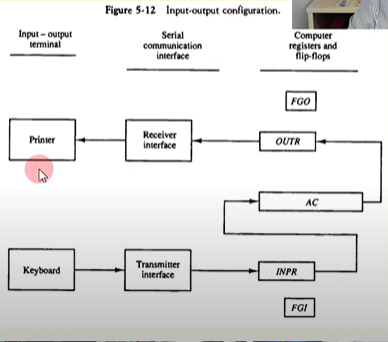
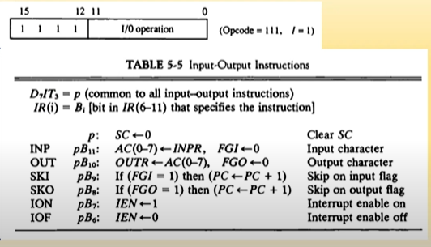
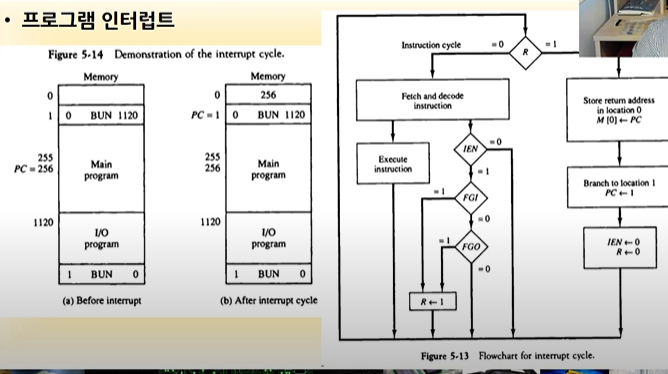
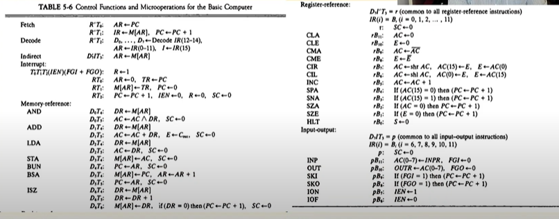
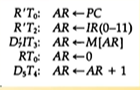
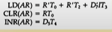
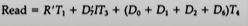
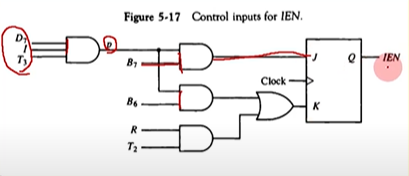

## [제 5장 Part-2-1](https://www.youtube.com/watch?v=eoswnrO_v9g&list=PLc8fQ-m7b1hCHTT7VH2oo0Ng7Et096dYc&index=12)

### 입출력과 인터럽트 (Input-Output and Interrupt)

#### 입출력 구성

- CPU와 IO 장치의 속도 차이 제어를 위하여 Flag 사용
  - Buffer overrun 상태
  - Buffer underrun 상태
- FGI 
  - 1 : 입력 가능한 상태
  - 0 : 입력 블러킹
- FGO 
  - 1 : 출력 가능한 상태
  - 0 : 출력장치 사용중
- 인터럽트(Interrupt)
  - IEN flag에 의하여 제어
  - 입출력 전체를 제어

#### 입출력 명령어

#### 프로그램 인터럽트

- 장치가 준비되었을 때 CPU에 알림
- 인터럽트 발생시 BSA 명령어처럼 동작
- FGI, FGO 플래그 사용
  - 플래그가 set되면 R<-1 
  - R=1이면 다음 명령어 사이클에 인터럽트 사이클 실행
- IEN
  - 인터럽트 enable/disable 제어 

#### I/O Program

- 입출력 인터럽트 처리 루틴의 집합 

#### IVT(Interrupt Vector Table)

- 각 인터럽트에 벡터번호 부여
- 벡터번호와 인터럽트 처리 루틴 시작번지를 Table로 유지
- 시스템 부팅시에는 IVT는 0번 segment에 load 
- 현대의 대부분의 CPU가 IVT 사용 

#### 인터럽트 사이클(IC)

- IC로 분기되는 조건
  - T0'T1'T2'(IEN)(FGI+FGO) : R <-1 
- 인터럽트 사이클의 실행
  - RT0 : AR <- 0, TR <- PC 
  - RT1 : M[AR] <- TR, PC <-0 
  - RT2 : PC <- PC+1, IEN <-0 , R<-0, SC<-0

## [제 5장 Part-2-1](https://www.youtube.com/watch?v=zQuOYWLbCI4&list=PLc8fQ-m7b1hCHTT7VH2oo0Ng7Et096dYc&index=13)

### 컴퓨터에 대한 완전한 기술 (Complete Computer Description)

#### 기본 컴퓨터 (PDP -11) 의 전체 명령어 set

### 기본 컴퓨터의 설계 (Design of Basic Computer)

#### 하드웨어 구성요소

- 16bit 4096 워드 메모리
- 9개의 레지스터
  - AR, PC, DR, AC, IR, TR, OUTR, INPR, SC
- 7개의 플립플롭
  - I, S, E, R, IEN, FGi, FGO
- 2개의 디코더
  - 3x8(Opcode), 4 x 16(타이밍)
- 16bit 공통버스
- 제어 논리 게이트
- AC 입력 연결 논리회로(ALU)

#### 컴퓨터 동작 흐름

- MRI, RRI, IO 명령 사이클 구현
- 인터럽트 사이클 구현

#### 레지스터와 메모리에 대한 제어

- AR 제어 논리 게이트의 예

- 설계 순서
  - AR에 대한 LD, CLR, INC 동작의 경우 수집
  - 각 동작들을 OR로 연결

- 메모리 READ 제어 게이트의 예 

#### 단일 플립플롭에 대한 제어

- IEN에 대한 제어게이트 예
  - pB7 : IEN <-1 
  - pB6 : IEN <-0
  - pB2 : IEN <-0 
    - p=D7IT3

#### 공통 버스에 대한 제어

- 인코더에 대한 부울식(from Table 5-7)
- x1에 대한 설계 예
  - D4T4 : PC<-AR
  - D5T5 : PC<-AR
  - x1 = D4T4 + D5T5 
- 메모리 읽기(x7)에 대한 설계 예
  - X7 = R'T1 + D7'T3 + (D0 + D1 + D2 + D6)T4 

### 누산기 논리의 설계 (Design of Accumulator Logic)

#### AC 레지스터 관련 회로

- AC를 변경하는 경우 주소 
- LD, CLR, INC

#### AC 레지스터에 대한 제어

- LD 신호 제어
  - MRI 명령 : AND, ADD, LDA
  - RRI 명령 : COM, SHR, SHL
  - IO 명령 : INPR
- INR 신호 제어
  - MRI 명령 : none
  - PRI 명령 : INC 
  - IO 명령 : none 
- CLR 신호 제어
  - MRI 명령 : none
  - RRI 명령 : CLR
  - IO 명령 : none 

#### 가산 논리 회로

- 회로 요소
  - AND gate
  - Full Adder 
  - Inverter
  - Shifter
  - INPR/OUTR