## [제 6장 Part-1](https://www.youtube.com/watch?v=bx3qZQb0LL8&list=PLc8fQ-m7b1hCHTT7VH2oo0Ng7Et096dYc&index=14)

### 기본 컴퓨터 명령어

- 명령어 Symbol <-> Hexa code 관계 

### 기계어 (Machine Language)

- 0과 1만 가지고 컴퓨터에 명령을 내리는 것 
- 컴퓨터가 유일하게 이해할 수 있는 언어

#### 프로그램의 종류

- 이진코드
  - 기계어 프로그램(코드)
  - 메모리상에 실제 나타나는 형태의 명령어 집합
  - 이진 명령어와 피연산자의 시퀀스로 구성
- 8진/16진 코드(Octal/Hexacode)
  - 이진 기계어 코드를 8진수, 16진수로 표현
- 기호 코드(Symbolic code)
  - 이진 기계어 코드에 대하여 문자로 된 심볼로 표현
  - 어셈블리어
- 고급 프로그래밍 언어
  - 하드웨어 구조와 관계없이 문제 해결 논리가 고려된 언어
    - 컴퓨터가 가지고 있는 하드웨어와 상관 없이 
  - 문제 위주의 기호와 형식 사용
  - 인터프리터, 컴파일러 사용
  - FORTRAN, PASCAL, C, C++ BASIC< Java, COBOL, Prolog, SKetch

### 어셈블리 언어 (Assembley Language)

#### 언어규칙

1. 라벨 필드 (Label) : 기호 주소, 또는 공란
2. 명령어 필드 : 기계 명령어, pseudo 명령어
3. 코멘트 필드 : 명령어에 대한 주석

#### 명령어 필드 항목

- 메모리 참조 명령어
- 레지스터 참조 명령어 , 입출력 명령어
- pseudo 명령어

#### 슈도 명령어 (Pseudo Instruction)

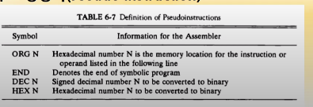

#### 어셈블리 프로그램 예

- 83 -(-23) = 106 
- 0x53 - 0xFFE9 = 0X6A

### 어셈블러 (The Assembler)

#### 어셈블러란?

- 기호-언어 프로그램을 이진 프로그램으로 번역하는 프로그램
  - MS Macro Assembler, Turbo Asembler 등
- Two pass 어셈블러
  - First pass, Second pass

#### 메모리 내에서 기호 프로그램의 표현

- 프로그램 예

  - PL3, LDA SUB I

    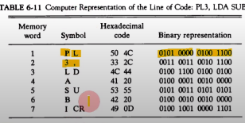

## [제 6장 Part-2](https://www.youtube.com/watch?v=hXKSCzaYCXk&list=PLc8fQ-m7b1hCHTT7VH2oo0Ng7Et096dYc&index=15)

### 프로그램 루프 (Program Loops)

#### 루프를 가지는 프로그램

- 어셈블리어로 표현
  - 루프 부분 
  - 카운터 부분
  - 데이터 array 부분 

### 산술 및 논리 연산의 프로그래밍 (Programming Arithmetic and Logic Operations)

#### 곱셈프로그램

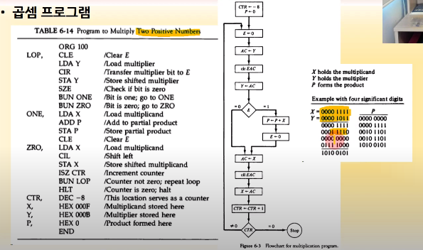

#### 배정밀도 가산

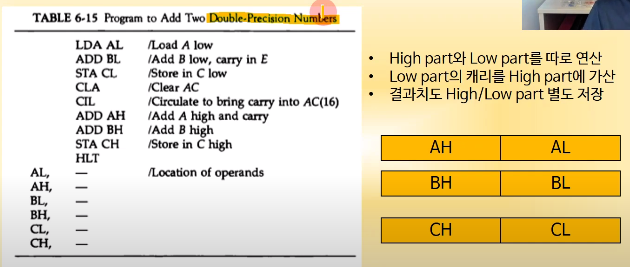

### 서브루틴 (Subroutines)

#### 서브루틴 사용 예

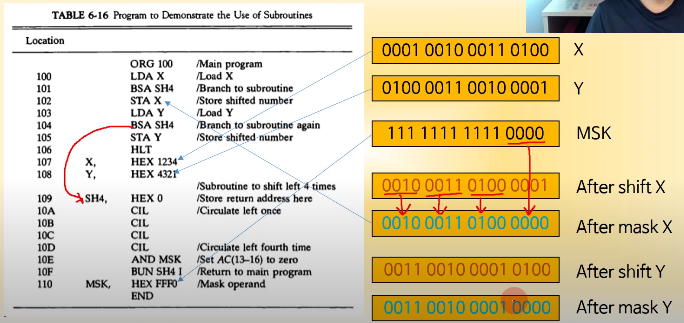

#### 서브루틴 파라미터와 데이터 링키지 (X OR Y 연산)

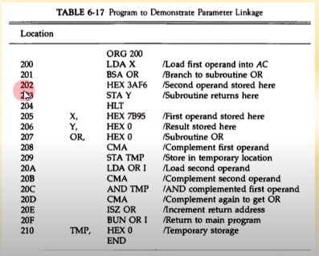

#### 16bit 데이터 블록의 복사(memcpy() 함수)

### 입출력 프로그래밍 (Input-Output Programming)

- 1개 문자의 입출력 

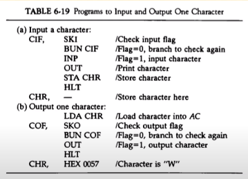

- 2개 문자의 패킹
  - 8bit ASCII -> 16bit UniCode 
  - SH4 서브루틴 사용 

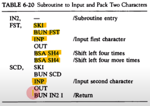

- 버퍼에 문자 저장

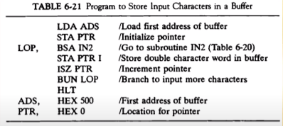

- 두 워드의 비교 

​	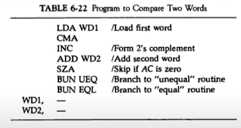

#### 프로그램 인터럽트

1. 레지스터들의 내용을 저장
   - M[xx] <- REGs 
   - IEN <-0 (by IOFF)
2. FGI/FGO Flag들의 값 체크
3. 인터럽트 서비스 루틴 수행
4. 레지스터 내용 원상 복구
   - REGs <- M[xx]
5. 인터럽트 기능 ON
   - IEN <- 1(by ION)
6. 원래 프로그램으로 복귀

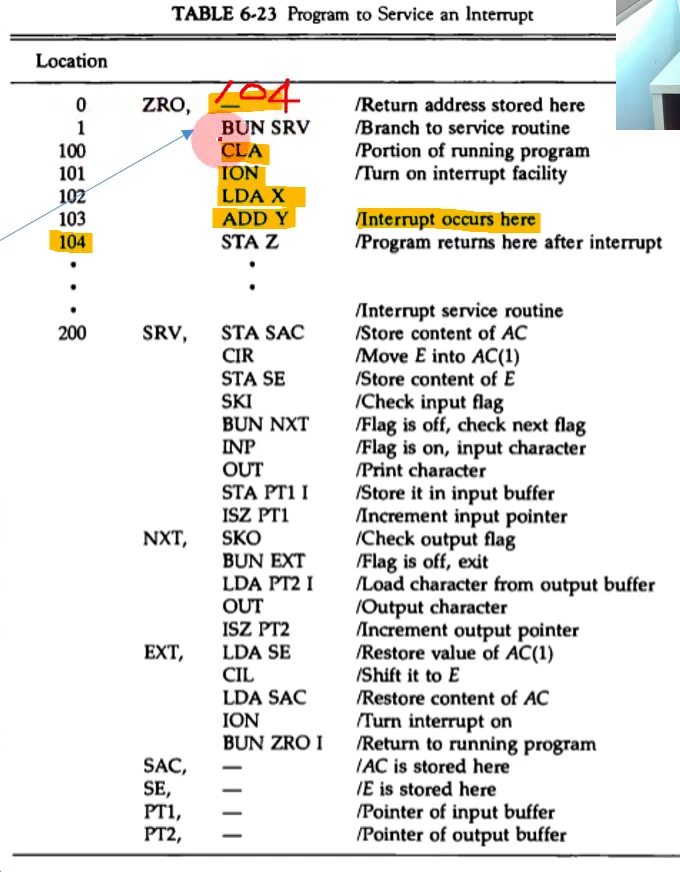

