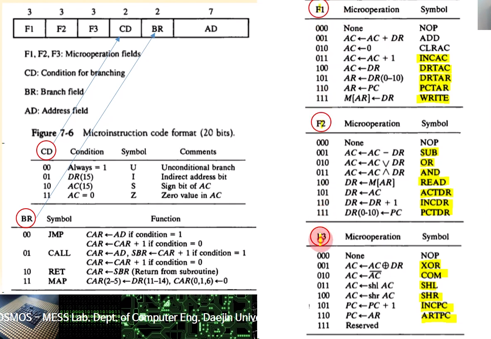
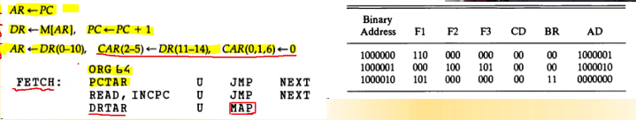
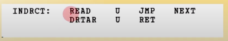
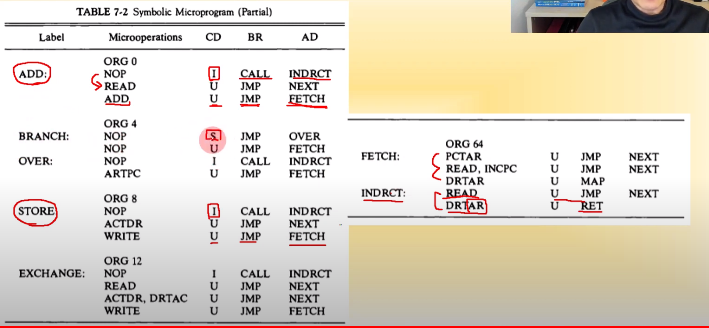

## [제 7장 Part-1](https://www.youtube.com/watch?v=nhJ1prbfmuE&list=PLc8fQ-m7b1hCHTT7VH2oo0Ng7Et096dYc&index=16)

### 제어 메모리 (Control Memory)

#### 하드와이어 제어 장치

- 하드웨어이적으로 제어 장치를 설계
- 일상적인 논리회로를 사용하여 구현

#### 제어 워드

- 버스 구조 시스템에서 정보 전달 제어 비트 모임
- 제어 워드에 의하여 마이크로 연산 수행

#### 마이크로프로그램

- 명령을 수행하는 일련의 제어 워드의 집합
- 별도의 기억장치에 저장된 프로그램 형태

#### 마이크로프로그램된 제어 장치 

- 마이크로프로그램을 사용하는 제어 장치
- ROM에 저장하여 사용
- 시퀀서(Sequencer)와 제어 메모리로 구성 

### 주소 시퀀싱 (Address Sequencing)

#### 초기 주소

- 시스템 부트시 jump하는 주소
- ROM BIOS 주소
- 하드웨어적으로 미리 결정된 주소
- IBM PC : 0xFFFE0(20bit XT)

#### 제어 메모리 주소 시퀀싱 단계 

- 명령어 fetch 
- 유효 주소 (Effective Addr.) 계산 
- 마이크로연산 수행을 위한 제어 워드 fetch
- 명령어 실행

#### 제어 메모리의 주소 결정하는 방법

- Branch by condition
- Mapping from Opcode 
- Subroutine call/return
- Increment 

#### 조건부 분기

- 상태비트 (U,I,S,Z)에 따른 분기 

#### 명령어의 매핑

- OPCODE로부터 제어워드 주소 분기
- 제어 메모리 크기 (비트수)에 맞는 매핑 논리 사용
- 명령어에 사용되는 제어 워드수에 따라서 매핑
- 매핑 비트의 결정
  - 제어 메모리 크기 : 128 -> 2'(7bit)
  - 명령어가 가지는 제어 워드 최대크기 3인 겨우
  - 2^1 <3 <2^2 이므로 2비트 간격으로 제어 메모리 배치

#### 서브루틴

- 동일한 제어 코드들을 서브루틴화 
- Fetch 제어, 간접주소 계산 등 
- SBR에 복귀 제어메모리 주소 저장 

## [제 7장 Part-2](https://www.youtube.com/watch?v=lBNXUYRcDHc&list=PLc8fQ-m7b1hCHTT7VH2oo0Ng7Et096dYc&index=17)

### 마이크로프로그램의 예 (Microprogram Example)

#### 마이크로 프로그램 제어를 위한 하드웨어 구성

- 128 x 20 제어 메모리 사용
  - 128개의 제어 워드 사용
  - 20bit의 제어워드로 구성

#### 컴퓨터 명령어 형식

- 마이크로프로그래밍을 위한 명령어 형식 

#### 마이크로 프로그래밍

#### 기호로 표시된 마이크로 명령어

- Fetch 루틴

- Indirect 루틴

### 제어 장치의 설계 (Design of Control Unit)

-