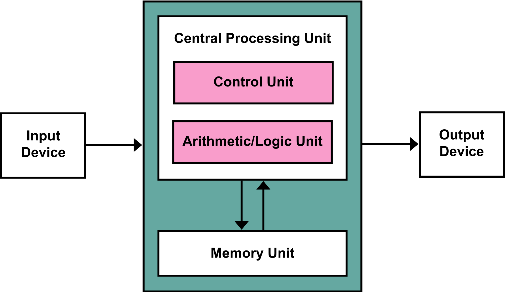

## 컴퓨터의 구조는 어떻게 되어있을까?

컴퓨터의 역사와 함께 현대적인 컴퓨터의 구조가 어떻게 변화되어 왔는지 가볍게 살펴보기 좋습니다.  
영상: ['컴퓨터'의 구조는 어떻게 되어있을까? CPU와 메모리! [안될과학 - 랩미팅 15화]](https://youtu.be/SiC74U8aJbM)

### 컴퓨터의 역사

**컴퓨터는 compute라는 `계산하다` + er `~하는 사람` = > 수학을 계산하는 직업이라는 의미였다.**

#### ENIAC

- 1946년에 만들어진 컴퓨터

- P.에커트 & J.W.모클리가 3년에 걸쳐 제작 

- 길이 25M 폭 1M  높이 2.5M 총 중량 30톤 

- 대중들에게 인식된 프로그래밍이 가능한 최초의 컴퓨터

- 연산 처리는 가능하나 별도의 소프트웨어 프로그램이 존재하지 않는다는 문제가 있었다. 

  - 변수를 넣기 위해 전선을 직접 변수에 맞춰 꽂는 방식(물리적)으로 구동된
  - 많은 노동이 필요한 컴퓨터

  - 편리한 컴퓨터를 만들 방법을 고안

#### 폰 노이만

- ENIAC에서 부족한 것이 무엇인가 ?
  - 코딩 
  - 저장가능한 소프트웨어가 있으면 CPU는 계산만 하면 될 것이라고 생각함 
  - 계산하는 CPU와 그 정보를 전달하는 소프트웨어, 그 소프트웨어를 가지는 하드웨어의 구성, 즉 컴퓨터 구성의 체계를 잡아준 사람! 

#### 논리구조를 어떻게 전기적 스위칭으로 표현할 것인가? 

- 논리적 결론에 도달하는 것 
  - 그렇다면 논리는 무엇인가?
    - 두 문이 있을 때, 두 사람이 문에 들어갔다고 가정해보자. 우리는 어떤 사람이 들어갔을지 맞춰야 한다.
    -  그 문을 열고 들어간 두사람이 누군지 모를 때 , 안에 있는 사람이 전구를 켜서 위치를 알려줄 수 있다.
    - 전구는 켜지고 꺼지고 두가지 역할밖에 없다.
    - 임의의 약속을 하는 것 
      - 여자가 2명이면 켜자 
      - 남자 1명 여자 1명이면 껐다 켜자 
    - 이러한 논리 회로들로 가득 차 있는 것이 CPU이다. 
- CPU 내부 논리 회로 

#### Jack Kilby

- 텍사스 인스트루먼트에서 근무하는 직원
- 반도체 공정으로 작은 스위치를 만들 수 있다면, 전선, 저항, 다이오드 커패시터 등 각종 부품들도 작게 만들 수 있지 않을까?
  - 회로를 한 곳에 몰아넣음 (Integrated Circuit)
  - 집적 회로의 원리를 만듬 
- 현재 CPU는 머리카락보다 얇은 전선들로 만들어져 있음 

### 컴퓨터 구조

#### CPU

- Control Unit
  - 정보를 순차적으로 처리 
- Logic Unit
  - 계산이나 연산
- 하지만 기억을 할 수 있는 역할이 없는 CPU
- 정보를 기억하는 역할을 할 '메모리'가 필요
- 기억을 꺼냄 > 계산 > 기억을 넣음 (Clock)

#### 메모리

- 0인지 1인지를 기억하는 역할
- RAM(Random Access Memory)
  - 초기 램은 1이라는 전압이 빠지지 않도록 루프를 만들었음  
  - 빠르지만, 기억하는 양이 작음 
  - CPU 안에 내장 
- DRAM
  - 작은 부품으로 숫자 하나를 기억할 수 있게 만듬
  - 더 많은 기억이 가능해짐
  - 하지만 속도가 느리다는 단점이 있음

#### HDD/SDD

- 오래 기억 가능한 큰 보관서고 필요하기 때문에 탄생
- RAM 메모리는 전원이 꺼지면 모두 소멸
- 영구적인 기억장치 역할 HDD 
- 그럼 RAM이 왜 필요할까? 
  - 내가 당장 기억할 것의 역할 RAM

##### 기억 속도

캐시 메모리 > DRAM > HDD 

## 컴퓨터-구조 / 운영체제

컴퓨터-구조부터 운영체제까지 과목의 전체적인 구조를 살펴보기 좋습니다.  
영상: [컴퓨터구조 운영체제 클라우드 안쉬고 처음부터 끝까지 30분동안 설명하기. 컴퓨터-구조 처음 공부하실 때 참고하세요.](https://youtu.be/uMyKBYF48nY)

- 컴퓨터 처음 공부하는 분이 뼈대로 알아놓으면 좋고 기술사, 정보처리기사 공부에도 도움이 됨

#### 컴퓨터 구조 기본

- 컴퓨터의 핵심 구조는 CPU이다. 그리고, 메모리, 이를 저장하는 디스크가 있다.
  - 이를 화면으로 출력하는 모니터, 입력하는 키보드 등으로 구성되어 있다. 
- 폰노이만구조는 해당 구조로 뼈대를 잡아가기 시작했다. 

- CPU,Memory, Disk와 맞물려 돌아가게 하는것이 운영 체제이다. 

- 여러가지 File이 묶인 것이 프로그램, 이런 프로그램을 실행하는 것을 프로세스, 실행되게 하는 것이 프로세서이다. 
