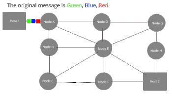
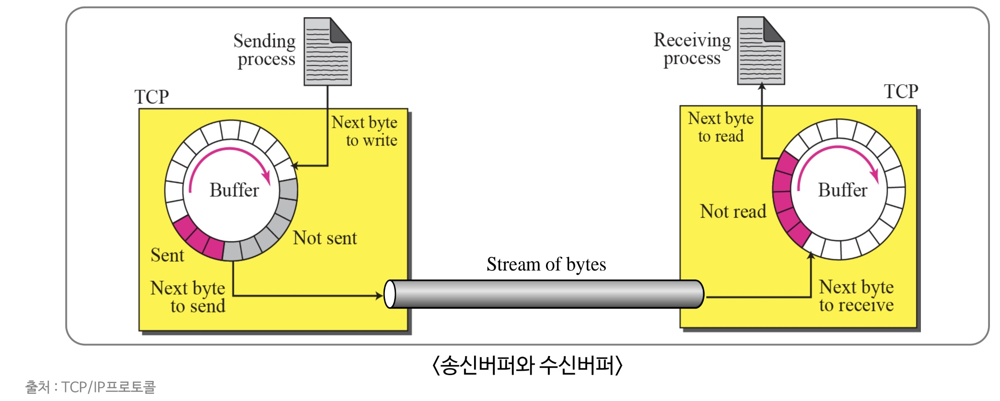
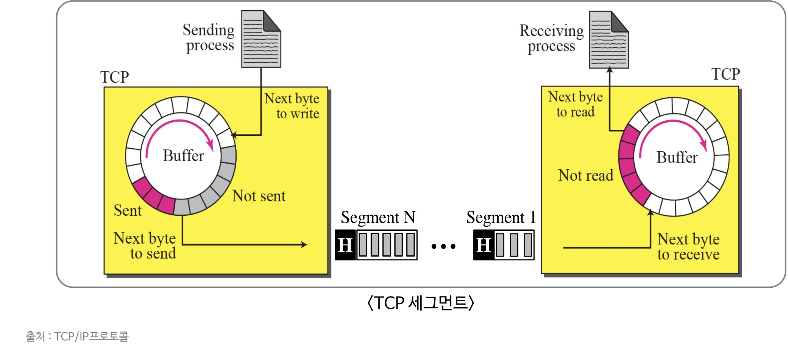
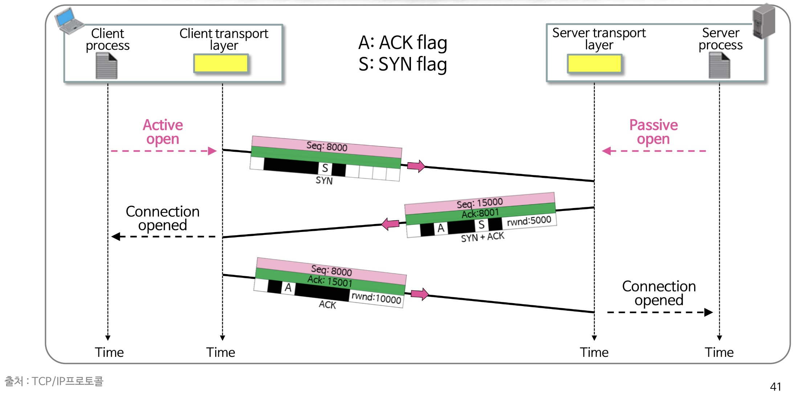
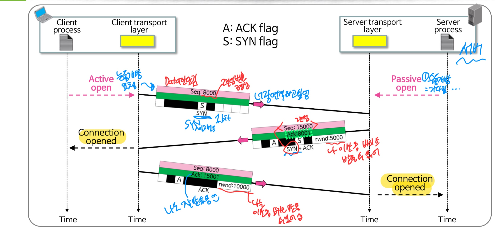
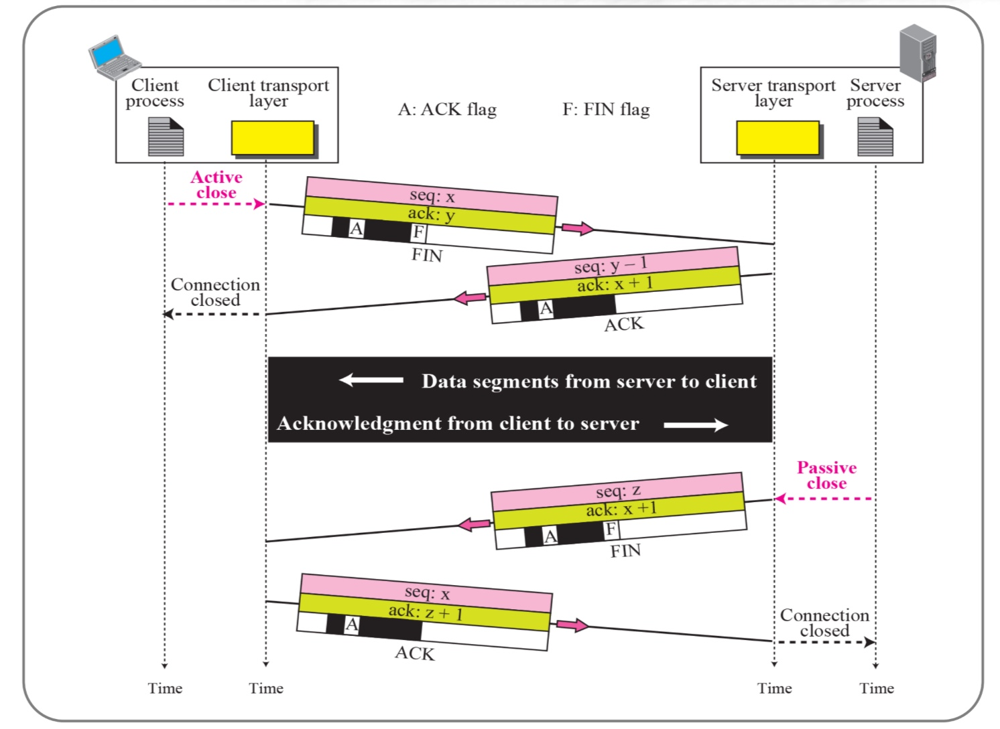

## 네트워크 

### 1. 패킷 네트워크

(1) 회선 교환 (Circuit Switching)

  : A가 B에게 전화를 걸었을 때 B 휴대폰은 전화를 받을 때까지 울리고, 만약 B가 다른 사람과 통화 중이라면, 통화중임을 알려준다. 전화는 A와 B간에 회선을 독점하는 것이므로 B가 단독으로 A의 전화를 받았을 때, 안정적으로 통화가 가능하다. 

- 장점
  - 회선 교환은 한번 연결이 이루어지면 안정적으로 통신을 할 수 있다. 
  - 대용량의 데이터를 고속으로 전송할 때 좋으며, 고정적인 대역폭을 사용한다.
- 단점
  - 연결이 이루어진다는 것은 선로를 독점해서 사용한다는 의미이기 때문에 자원을 많이 필요로하고 다중 통신이 어렵다는 문제가 있다. 
  - 속도나 코드의 변환이 불가능해 교환망 내에서의 여러 제어 기능이 어렵다. 
  - 실시간 전송보다 에러 없는 전송이 요구되는 구조에서는 부적합하다. 
  - 통신비용이 고가이다 

(2) 인터넷 통신에서 패킷 네트워크의 필요성

- 패킷이란?

  : 인터넷 내에서 데이터를 보내기 위한 경로배정을 효율적으로 하기 위해서 데이터를 여러 개의 조각들로 나누어 전송을 하는데 이때, 이 조각을 패킷이라고 한다. 

- 패킷 교환 방식

- 데이터를 한 번에 통으로 보낸다면, 큰 데이터는 대역폭을 너무 많이 차지하기 때문에 해당 대역폭을 이용할 수 있는 사용자의 수가 줄어들어 데이터의 흐름이 원활하게 하지 못해 트래픽이 증가한다.

   예를 들어 4차선 도로를 1000km 의 자동차가 지나가는 것 보다는, 작은 자동차 여러대가 지나가는 것이 많은 사용자들이 이용하는 도로에서는 효율적일 것이다. 

- 큰 데이터를 여 개의 작은 패킷들로 분할하여 번호나 규칙을 통해 상대방에게 전달하며, 상대방을 받은 패킷에서 데이터 외의 추가적인 정보들을 조합하여 큰 데이터로 만들어 데이터를 받는 것이다. 

- 이렇게 나뉘어져서 전송된 패킷의 유실이 있는지 등을 추적하고 관리하는 프로토콜이 TCP/UDP 이며 Data의 Header에 붙어 작용한다. 특히 TCP 가 패킷 네트워크가 발전하는 데에 큰 역할을 했다. TCP와 UDP는 OSI 7 Layer 의 전송 계층에서 사용하는 프로토콜이다.  간단히 전송계층을 설명하자면 이는 송신자와 수신자를 연결하는 통신서비스를 제공하는 계층으로 데이터의 전달을 담당한다. 데이터를 보내기 위해 사용하는 프로토콜이 TCP와 UDP이다. 

### 2. TCP

---------

(1) TCP 서비스

:heavy_check_mark: 스트림 배달

- 스트림 배달(Stream delivery) 서비스 제공. TCP는 바이트 스트림의 형태로 데이터를 송수신한다. 
- TCP 계층은 데이터의 시작과 끝을 구분하지 않고 연속적인 데이터의 흐름으로 보며 처리한다. 따라서 송신자로부터 스트림 배달이 오면 수신자가 알아서 패킷을 묶어주어야 한다. 

:heavy_check_mark: 송수신 버퍼

- 흐름제어와 오류제어를 위한 송수신 버퍼 기능을 가지고 있다. 

  - 흐름제어?

    - 흐름제어는 데이터가 송신하는 곳과 수신하는 곳의 데이터 처리 속도를 조절하여 수신자의 버퍼 오버플로우를 방지하는 것이다. 송신하는 곳에서 감당이 안되게 많은 데이터를 보내면 수신자에서 문제가 발생하기 때문이다. 

  - 오류제어?

    - 데이터의 프레임이 손상되었거나 손실되었을 경우 재전송을 통해 오류를 복구한다. 

    

    

  - 해당 송신버퍼와 수신버퍼를 통해 수신버퍼가 받을 수 있는 다음 byte가 있는 경우에 송신버퍼가 보낼 것이 다면 데이터를 송신한다. 

:heavy_check_mark: TCP 세그먼트(segment)

- TCP는 스트림 배달을 제공하지만, 하위계층인 IP 프로토콜은 패킷의 형태로 데이터를 전달한다. 
- TCP는 이러한 일련의 바이트를 세그먼트라는 패킷으로 그룹화한다. 세그먼트의 크기는 그때 그때 다르다. 

:heavy_check_mark: 추가 특징 

- 전이중 통신 서비스 : 양 방향으로 데이터를 송수신하므로 동시 송수신이 가능하다
- 신뢰성 서비스 : 데이터를 제대로 받았는지 확인하는 확인 응답 메커니즘을 통해 오류없는 데이터 전송 서비스를 제공한다.
- 연결지향 서비스
  - 두 TCP 간에 가상 연결을 설정한 이후에 데이터를 교환하고, 데이터 교환이 완료된 뒤에 연결을 종료한다. 이는 가상 회선 방식을 제공한다고도 설명하며, 발신지와 수신지를 연결하여 패킷 전송의 논리적 경로를 배정한다. 
  - 3-way handshaking 과정을 통해 연결을 설정하고, 4-way handshaking을 통해 연결을 해제한다.

(2) 3-way handshake

:one: 클라이언트 TCP가 SYN 세그먼트를 서버 TCP로 전송

- 임의의 초기 순서번호를 정하여 전송

- 전송하는 데이터는 없지만 하나의 순서 번호를 소비함

  

:two: 서버 TCP는 (SYN + ACK) 세그먼트를 클라이언트 TCP로 전송

- 서버 송신측이 사용할 초기 순서번호를 정하여 전송ㅎ
- 수신하기를 기대하는 다음 순서번호를 담아서 ACK 하는 것.

:three: 클라이언트 TCP는 ACK 세그먼트를 서버 TCP로 전송

(3) 데이터 전송

- 데이터 전송과 확인 응답을 동시에 전송한다. 피기백(piggyback)
- 푸쉬(Push) 플래그
  - TCP에서 데이터를 버퍼에서 대기시키지 않고 바로 전송하고 수신 TCP에서도 바로 응용프로그램으로 전달할 수 있도록 요청한다.
- 긴급(Urgent) 플래그 & 긴급 포인터
  - 응용프로그램이 특별히 처리해야 할 데이터를 구분하여 전달하는 용도로 정의된다. 

(4) 4-way handshake

: 연결을 해제하는데에는 절반닫기(4-way handshake) 방식이 있다. 

:one: 송신 TCP가 수신 TCP에게 FIN 세그먼트를 전송

:two: 수신 TCP가 송신 TCP에게 ACK 세그먼트 전송

--------------수신 TCP는 아직 보낼 수 있는 상태----------------------

:three: 수신 TCP가 송신 TCP에게 FIN 세그먼트를 전송

:four: 송신 TCP가 수신 TCP에게 ACK 세그먼트 전송

-----

###  3. UDP

(1) UDP의 특징

- UDP의 헤더는 8바이트로 TCP에 비하여 간략한 구조를 가지고 있다.
  - 최소화된 오버헤드 구조로, Source port number, Destination port number, Total length, Checksum 으로 헤더의 포멧이 구성되어 있다. 
- 비연결형의 신뢰성이 낮은 전송 프로토콜로, 메시지 단위의 전송 프로토콜이다. 
  - 메시지를 더 작은 단위로 자르거나 재조합하지 않고 이를 하기 위해서는 다른 계층(응용계층)에서 자르고 재조합해야한다.  그 크기는 65535 바이트로, 크기가 초과되면 다음에 잘라서 보낸다. 
  - 비현결형 서비스?
    - 각 사용자의 데이터 그램이 독립적이라는 것이다. 즉 연결을 위해 할당되는 논리적인 경로가 없고 각각 다른 경로로 데이터를 독립적으로 처리하게 된다. 
    - 따라서 흐름을 제어하거나, 혼잡을 제어할 수 없으며 , 헤더와 사용자 데이터그램에 검사합(Checksum) 만을 이용해 오류가 발생했는지 여부 정도만 판단할 수 있다. 그러나 오류가 생겼으니 다시 해당 데이터를 보내달라는 재전송 기능은 제공하지 않는다. 따라서 신뢰성이 낮다.
- 비정규적인 송신률 
  - UDP는 송신율에 간섭하지 않고 응용계층의 의도대로 전송하며, 네트워크의 상황을 고려하지 않고 전송을 한다. 

(2) UDP 의 장단점

- 정보를 주고 받을 때, 정보를 보내거나 받는다는 신호 절차를 거치지 않고 적은 정보량만을 보내기 때문에  TCP보다 속도가 빠르다. 연결을 설정하고 해제하는 과정이 존재하지 않기 때문에 네트워크의 부하가 작지만 데이터가 전송되었는지 여부를 보장하지는 못한다. 
- 그렇기 때문에 연속성과 성능이 중요한 서비스인 실시간 서비스(streaming)에 자주 사용되며 파일전송과같은 신뢰성이 필요한 서비스에서는 잘 사용하지 않는다.. 

출처 :

1. B.A.Forouzan, "TCP/IP 프로토콜", 4th edition, McGraw-Hill Korea, 2012

2. https://ko.wikipedia.org/wiki/%ED%8C%A8%ED%82%B7_%EA%B5%90%ED%99%98