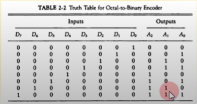

## [제 2장 Part-1](https://www.youtube.com/watch?v=aj74NlGUAk4&list=PLc8fQ-m7b1hCHTT7VH2oo0Ng7Et096dYc&index=4)

### 집적회로 (Integrated Circuits)

-  정의
  - 디지턴 게이트를 구성하는 전자 부품을 포함하는 실리콘 반도체 칩
  - 칩 내부에 게이트들이 연결되고 외부로도 연결된다.
  - 칩의 등록 번호로 구분(dataBook을 통해 정보 확인 가능)

- 집적 규모에 따른 분류
  - SSI : 소규모, 10개 이하의 게이트들로 구성 됨
  - MSI : 중규모, 10-200개의 게이트들로 디코더, 가산기, 레지스터 구현
  - LSI : 대규모, 200~1000개의 게이트들로 프로세서나 메모리칩과 같은 디지털 시스템 형성
  - VLSI : 초대규모, 수천개 이상의 게이트 집적, 대형 메모리나 마이크로 컴퓨터 칩 구성
    - 보통 컨트롤러가 VLSI

- 디지털 논리군에 따른 분류
  - TTL (Transister-Transistor Logic)
    - 일반 로직 회로 부품
  - ECL (Emitter-Coupled Logic)
    - 고속 논리 시스템용 부품(1~2ns 이하), 슈퍼컴퓨터용
  - MOS (Motel Oxide Semiconductor)
    - 고밀도 집적회로용 부품, 대부분의 고밀도 집적회로에서는 이 방식을 사용한다.
  - CMOS ( Complement Metal Oxide Semiconductor )
    - 고밀도 회로, 단순한 제조공정, 저전력 특성

### 디코더 (Decoders)

- N 비트의 이진 정보를 서로 다른 2의 N승 개의 원소 정보로 출력

- NAND 게이트로 이루어진 디코더

  - 대부분의 출력 신호가 0으로 유지되는 AND게이트와 달리, 대부분의 출력 신호가 1로 유지되는 디코더

  - 이렇게 보수화된 출력이 더욱 경제적이다.

  - CMOS 회로의 영향으로 저전력 회로에 유리

    

- 인코더

  

  - 디코더와 반대 동작을 수행한다.
  - 2의 N승의 입력에 대해 N 개의 이진코드를 출력한다.
  - 한번에 하나의 입력 만이 1의 값을 가질 수 있음

### 멀티플렉서 (Multiplexers)

- N개의 선택 입력에 따라 2의 n개의 출력을 하나의 출력에 선택적으로 연결
- 다중 입력 중 하나를 선택하여 출력으로 연결해준다.
- 네트워크 스위치(전화, LAN, WAN) 의 기본 구조 요소.

### 레지스터 (Registers)

- 레지스터의 구성
  - N비트 레지스터 : N비트의 이진 정보 저장
  - N개의 플립플롭과 조합 회로로 구성
- 기본 레지스터
  - 클럭펄스 타이밍에 입력값이 레지스터에 저장된다.
  - 레지스터에 저장된 값은 항상 출력에서 참조할 수 있다.
  - Clear, Clock 입력 제공
- 병렬로드 가능한 4비트 레지스터
  - 4비트의 데이터를 동시에 입력 가능
  - Load, Clock 입력 제공

## [제 2장 Part-2](https://www.youtube.com/watch?v=7VPjQMeiHg0&list=PLc8fQ-m7b1hCHTT7VH2oo0Ng7Et096dYc&index=5)

### 시프트 레지스터 (Shift Registers)

- 정의

  - 레지스터에 저장된 이진 정보를 단방향 / 양방향으로 이동 가능한 레지스터

  - 각 FF 들의 입력이 출력과 cascade로 연결된다

  - 공통의 clock이 다음 상태로의 이동을 제어한다.

    

- 병렬로드를 가지는 양방향 시프트 레지스터 ( General Register )

  - 병렬로드, 왼쪽/오른쪽 시프트, 병렬출력 기능

  - 동기화된 clock에 의하여 동작

  - 범용 레지스터를 지칭한다. 

  - 레지스터에 병렬로 동시에 로드할 수 있는 제어를 가지고 있으면서, 각 플립플롭의 값을 양방향으로 보내줄 수 있고, 출력도 양 방향으로 각각 가능한 레지스터이다.

    

### 이진 카운터 (Binary Counters)

- 이진 카운터
  - 정해진 순서대로 상태 변이 수행
  - clock 또는 외부 입력에 따른 상태 변이
  - 용도?!
    - 사건의 발생 횟수를 카운트 한다.
    - 동작 순서 제어 타이밍 신호 발생에 적용한다.

- 병렬 입력을 가진 이진 카운터
  - 카운터의 초기값 설정 가능
  - 병렬 입력을 통해 초기값을 로드한다.
  - Load, Clear, Increment 기능을 가진다.
    - Load : 카운터의 값을 로드해 플립플롭에 상태값을 전달한다.
    - Clear : 상태 값을 0으로 clear 한다.
    - Increment : 

### 메모리 장치 (Memory Unit)

- 정의

  - 정보의 입출력 기능을 가지는 저장 요소들의 집합

  - Word 단위로 정보를 저장한다.

    - Word  ?

      - 입출력에서 하나의 단위로 취급되는 비트의 그룹

    - Byte : 워드의 기본 단위

      

- RAM ( Random Access Memory )

  - Word의 물리적인 위치에 관계 없이 데이터 접근
  - 모든 데이터 위치에 대하여 동일한 접근 시간을 가진다.
  - N 비트의 입력 / 출력 
  - K 개의 주소 라인으로 2의 N승 개의 Word 중 하나를 선택한다.
  - 읽고 쓰는 기능을 가진다 ( R/W )

- ROM ( Read Only Memory )

  - 한 번에 저장된 데이터를 읽는 기능만 있다. 
  - 1 Word가 N 비트이고 M 월드를 저장하는 NXM ROM
  - ROM 에 저장된 M word를 접근할 수 있는 K개의 주소 입력
  - 전원을 꺼도 휘발되지 않는다.

  

  - ROM의 종류

    - Mask ROM : 석판화(Lithography) 방식으로 구워져서 나오는 ROM
    - PROM : 딱 한 번만 프로그램할 수 있다.
    - EPROM : UV에 의한 데이터 삭제 (ROM 초기화) 및 재프로그래밍 가능하다.
    - EEPROM : 전기 신호에 의한 데이터 삭제 / 초기화 및 재프로그래밍 가능

    

  - ROM의 기능을 하는 RAM

    : 기능적으로는 ROM인데 실제로는 RAM -> 전원을 꺼도 데이터가 휘발되지 않는다.

    - Flash-RAM : BIOS, USB memory, SD card

    - NV-RAM

      - Non-Volatile RAM

      - Battery Backup RAM : 내장 배터리로 데이터를 hold

        