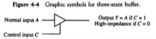
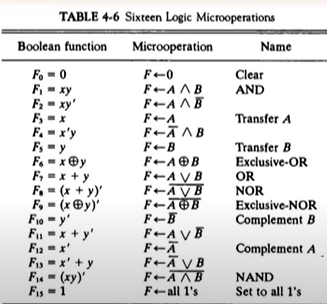

## [제 4장 Part-1](https://www.youtube.com/watch?v=LDjco5XJH1E&list=PLc8fQ-m7b1hCHTT7VH2oo0Ng7Et096dYc&index=8)

- 레지스터 전송 언어 (Register Transfer Language)

  - 마이크로 연산(Micro-operation)
    - 레지스터에 저장된 데이터를 가지고 실행되는 동작
    - 하나의 clock 시간 동안 실행되는 기본적인 동작은 Shift, Count, Clear, Load... 가 있다.

  - 레지스터 전송 언어
    - 마이크로연산, 전송을 간단하고 명료하게 표시하기 위하여 사용하는 기호이다.
    - 디지털 컴퓨터의 내부 조직을 상세히 나타내는 수단으로 사용한다.
    - 디지털 시스템의 설계 편의성을 제공한다.

  - 레지스터 전송 언어 규칙
    - 대문자로 표시한다. (MAR, MBR, AC, PC, DR)
    - 레지스터 가장 왼쪽 비트 : MSB (Most Significant Bit)
    - 레지스터 가장 오른쪽 비트 : LSB (Least Significant Bit)

  

  ### 레지스터 전송 (Register Transfer)

  : 레지스터에서 다른 레지스터로 정보를 전송하는 기능

  - 레지스터 정보 전송
    - 치환(Replacement) 연산자 사용
      - R2 :arrow_left: R1

    - 제어조건이 있을 경우, 
      - If (P = 1) then (R2 <----R1)

    - 제어 함수로 표현할 경우,
      - P : R2 <----R1
      - P ? R2 = 0 : R1 = 0
      - R2 에는 t + 1 타이밍에 전송 완료

  - 레지스터 전송의 기본 기호
    - Register data exchange
      - T : R2 <- R1 , R1 <--- R2

  

  ### 버스와 메모리 전송 (Bus and Memory Transfers)

  - 공통 버스 (Common Bus)

    - 레지스터들 사이의 전송 통로

    - 한 번에 하나의 신호만 전송하도록 제어한다. 

    - 멀티플렉서를 사용하여 레지스터를 선택한다.

      

  - 3-상태 버퍼(3-state Buffer)

    - 멀티플렉서 대신 사용하여 버스를 구성할 수 있다. 

    - 3개의 상태를 기반으로 동작한다.

      

      

      - 논리 0
      - 논리 1
      - 고저항 상태(High-impendance)

## [제 4장 Part-2](https://www.youtube.com/watch?v=IUapFpDKhKI&list=PLc8fQ-m7b1hCHTT7VH2oo0Ng7Et096dYc&index=9)

#### 마이크로 연산의 분류

- 레지스터 전송 마이크로 연산 : 레지스터간 이진 정보 전송
- 산술 마이크로 연산 : 수치 데이터에 대한 산술 연산
- 논리 마이크로 연산 : 비수치 데이터에 대한 비트 조작 연산
- 시프트 마이크로 연산  : 데이터에 대한 시프트 연산

### 산술 마이크로 연산 (Arithmetic Micro-operations)

- 이진 가산기
  - 두 비트와 이진 캐리의 산술합을 계산
  - 여러 개의 전가산기를 연결한다.

- 이진 감가산기
  - 보수를 만드는 게이트와 신호를 사용한다. 

### 논리 마이크로 연산 (Logic Micro-operations)

### 시프트 마이크로 연산 (Shift Micro-operations)

- 논리 시프트
  - 직렬 입력으로 0이 전송된다. 

- 순환 시프트
  - 직렬 출력이 직렬 입력으로 전송된다. 

- 산술 시프트
  - 부호 비트를 제외하고 시프트
  - 왼쪽 시프트는 2배가 되며, 오른쪽 시프트는 /2 가 된다. 

- 4비트 조합회로 시프터
  - 하드웨어로 구현!

-