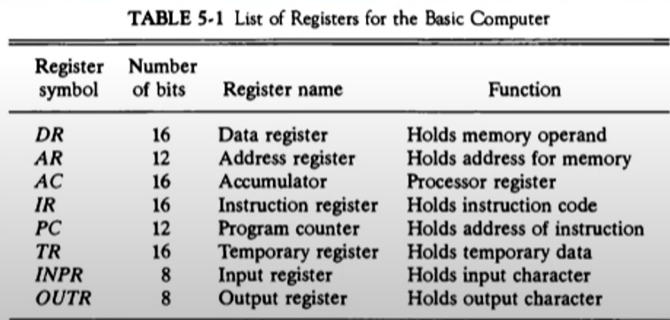
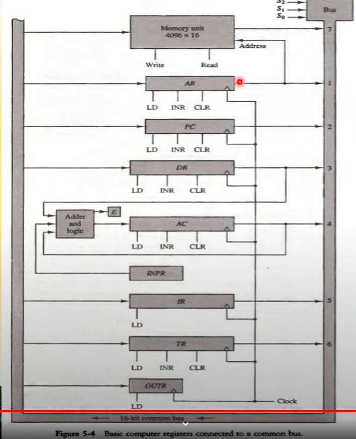

## [제 5장 Part-1-1](https://www.youtube.com/watch?v=vSnpYzCuwVY&list=PLc8fQ-m7b1hCHTT7VH2oo0Ng7Et096dYc&index=10)

### 명령어 코드 (Instruction Codes)

- 컴퓨터의 동작

  - 레지스터 내에 저장된 데이터에 대한 마이크로 연산의 시퀀스에 의해 정의된다.
  - 범용 컴퓨터 시스템에서는 다양한 마이크로 연산 시퀀스를 정의할 수 있다. 

- 명령어 코드

  - 명령어 코드란 컴퓨터에게 어떤 특별한 동작을 수행할 것을 알리는 비트들의 집합이다.
  - 연산 코드들로 구성된다.

- 컴퓨터 명령어

  - 컴퓨터에 대한 일련의 마이크로 연산을 기술한 것이다. 
  - 이진 코드로 구성된다.
  - 데이터와 함께 메모리에 저장된다. 

- 프로그램

  - 사용자가 원하는 연산과 피연산자가 처리되는 순서를 기술한 컴퓨터 명령어의 집합 (기계어)

  - 명령어 처리 과정을 제어한다.

    

- 내장 프로그램

  - 제어 신호에 의하여 명령어의 이진 코드를 해석하여 실행하는 것을 내장 프로그램이라고 부른다.
  - 명령어를 저장하여 실행하는 컴퓨터의 구동 방식을 일컫는다. 
  - 저장(내장) 프로그램의 구조
    - 명령어의 집합으로 구성된다. 
    - 각 명령어들은 명령어 포맷(Instruction format)에 따라서 정의되어 있다.
    - 프로그램 실행부분에 따라서 메모리의 다른 부분(segment)에 저장된다.
    - 명령어 실행 결과는 AC에 저장된다.

- 간접주소(Indirect Address) 시스템

  

  - (a) 맨 앞의 I bit가 0일 때에 직접주소 시스템, 1일 때 간접주소 시스템.

  - 직접주소 (b)를 설명하자면, 457에 가면 직접적으로 Operand가 나와있다.
  - 반면 간접주소인 (c) 에서는 Address에 해당하는 곳으로 가면  Operand가 있는 주소가 다시 적혀져 있다. 

### 컴퓨터 레지스터 (Computer Registers)

- 기본 컴퓨터의 레지스터

  - 기본컴퓨터란?

    - DEC PDP-11 Mini Computer
    - 가상의 컴퓨터가 아닌 실제 제품
    - 최신의 CPU도 기본적으로는 동일한 구조를 가지고 있다.

  - 기본 컴퓨터의 레지스터 종류

    

- 버스(BUS)

  : 레지스터들을 서로 연결해서 데이터를 레지스터들 간에 주고 받을 수 있게 해주는 길

  - 버스 시스템의 종류

    - 내부 버스
      - CPU(컴퓨터) 내부 레지스터들간 연결
    - 외부 버스
      - CPU 내부 레지스터와 메모리간 연결
    - 입출력 버스
      - CPU와 주변장치(I/O)간 연결

  - 공통 버스 시스템

    - 공통 버스에서 데이터를 전송하고 전송 받는다. 

    - 내부 버스를 통칭한다. 

    - 내부 버스의 크기(Width) 로 CPU 워드 크기가 결정된다.

      ( 내부버스의 크기 ) : 한 번에 몇 비트의 데이터를 전송할 수 있는가를 나타낸다.

      - ex) 16bit 컴퓨터 - 내부 버스 / 레지스터의 크기가 16bit, 한 번에 16 bit의 데이터를 전송 가능

    - 전송 연결 통로

      - 레지스터와 레지스터 간에 데이터를 전송하는 통로
      - 레지스터와 메모리 간에 데이터 전송 통로로는 예외적으로 표현된다.
      - 한 순간에 하나의 전송 만이 버스에 존재할 수 있다. 
        - 2개 이상의 신호 발생 시에는 버스 충돌(Collision)이 발생
        - 버스 제어기(정확한 타이밍과 MUX 제어 수행)로 공통 버스 시스템 제어

      

## [제 5장 Part-1-2](https://www.youtube.com/watch?v=T2oKxvinK84&list=PLc8fQ-m7b1hCHTT7VH2oo0Ng7Et096dYc&index=11)

### 컴퓨터 명령어 (Computer Instructions)

- 기본 컴퓨터 명령어의 종류

  

  

  - (a) MRI 명령어 (7개): 메모리에 있는 주소값을 참조해서 Opcode를 처리하는 명령어

  - (b) RRI 명령어 (12개): 레지스터와 레지스터 간의 관계 혹은 레지스터를 변경하는 명령어

  - (c) IO 명령어 (6개): IO 장치에 설정하여 입출력을 변경, 처리하는 명령어

    

### 명령어 사이클 (Instruction Cycle)

- 명령어 사이클 단계

  1. 메모리에서 명령어 가져오기 (Fetch)
  2. 명령어 디코딩
  3. 유효주소(Effective Address) 계산
  4. 명령어 실행

   

### 메모리 참조 명령어 (Memory-Reference Instuctions)

- 메모리 참조 명령어의 종류와 동작

  

  - BSA

    - 함수, 서브루틴의 구현에 사용한다. 
    - 간접주소를 사용하는 전형적인 예

  - ISZ 

    - Loop 제어문 구현에 사용된다 (for, while)

      
