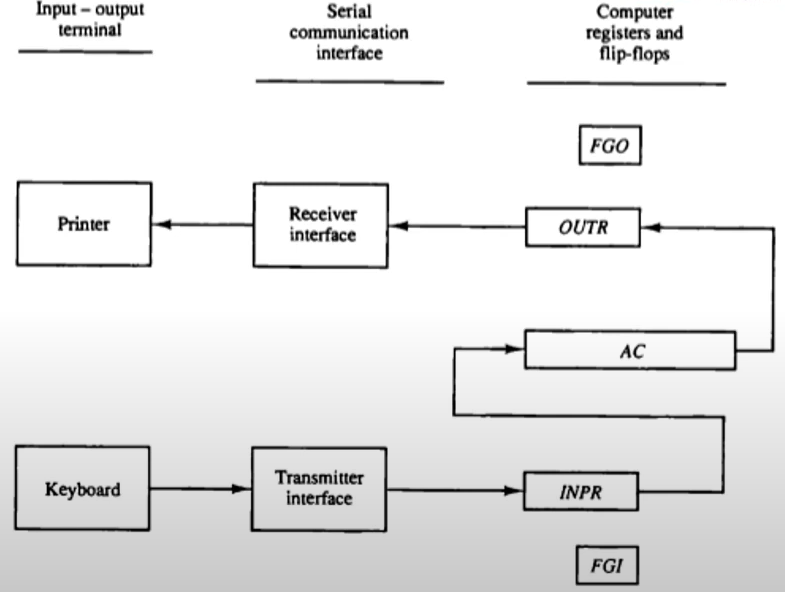
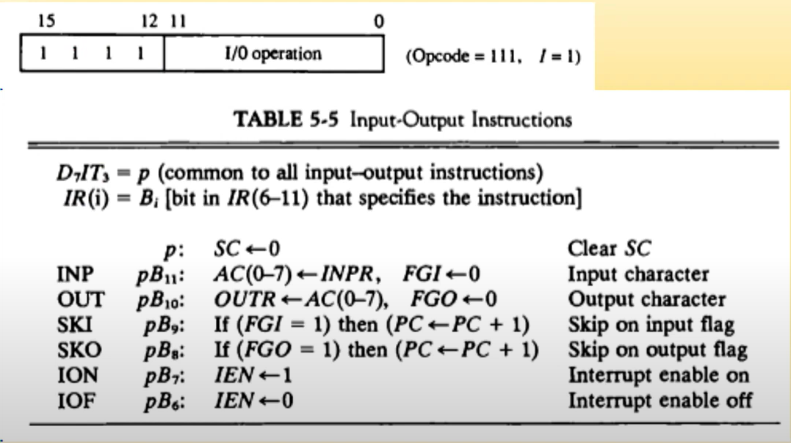
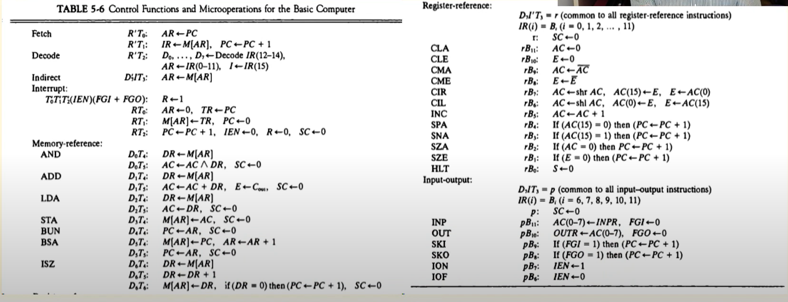
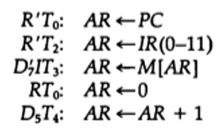

## [제 5장 Part-2-1](https://www.youtube.com/watch?v=eoswnrO_v9g&list=PLc8fQ-m7b1hCHTT7VH2oo0Ng7Et096dYc&index=12)

### 입출력과 인터럽트 (Input-Output and Interrupt)

- 입출력 구성

  

  

  

  - CPU보다 IO장치의 속도 차이(IO가 훨씬 느림)를 제어하기 위해 Flag를 사용한다.
    - Buffer overrun 상태
    - Buffer underrun 상태
  - FGI
    - 1: 입력 가능한 상태
    - 0 : 입력 블럭킹
  - FGO
    - 1 : 출력 가능한 상태
    - 0 : 출력 장치 사용 중
  - 인터럽트(Interrupt)
    - IEN flag에 의해 제어한다.
    - 입출력 전체를 제어함

- 입출력 명령어

  

- 프로그램 인터럽트
  - 장치가 준비되었을 때 CPU에게 알림
  - 인터럽트 발생 시 BSA명령어처럼 동작한다.
  - FGI, FGO 플래그를 사용하여
    - 플래그가 set되면 R <- 1
    - R = 1이면 다음 명령어 사이클에 인터럽트 사이클을 실행한다. 
  - IEN
    - 인터럽트 enable/disable 제어

- I/O Program
  - 입출력 인터럽트 처리 루틴의 집합을 말한다.
  - BIOS(Basic I/O System)
- IVT(Interrupt Vector Table)
  - 각 인터럽트마다 벡터 번호를 부여하여 제어
  - 벡터 번호와 인터럽트 처리 루틴 시작번지를 Table로 유지하고, 시스템 부팅 시에 IBT는 0번 Segment에 Load
  - 현대의 대부분의 CPU가 IVT를 사용한다. 

## [제 5장 Part-2-1](https://www.youtube.com/watch?v=zQuOYWLbCI4&list=PLc8fQ-m7b1hCHTT7VH2oo0Ng7Et096dYc&index=13)

### 컴퓨터에 대한 완전한 기술 (Complete Computer Description)

- Fetch , Decode, Indirect, Interrupt
- Memory-reference 명령
- Register-reference 명령
- Input-output 명령

### 기본 컴퓨터의 설계 (Design of Basic Computer)

-  하드웨어의 구성요소

  - 16 bit 4096 워드 메모리
  - 9개의 레지스터 : AR, PC, DR, AC, IR, TR, OUTR, INPR, SC
  - 7개의 플립플롭 : I, S, E, R, IEN, FGI, FGO
  - 2개의 디코더
    - 3 * 8 (Opcode), 4 * 16 (타이밍)
  - 16 bit 공통 버스
  - 제어 논리 게이트
  - AC 입력 연결 논리 회로(ALU)

- 컴퓨터의 동작 흐름

  

  - MRI, RRI, IO 명령 사이클 구현
  - 인터럽트 사이클 구현

- 레지스터와 메모리에 대한 제어

  - AR 제어 논리 게이트의 예시는 다음과 같다. 

  - 설계 순서

    - AR에 대한 LD, CLR, INC 동작의 경우에는 수집한다. 

    - 각 동작들은 OR로 연결된다. 

      

### 누산기 논리의 설계 (Design of Accumulator Logic)

- AC 레지스터에 대한 제어
  - LD 신호 제어
    - MRI 명령 : AND, ADD, LDA 
    - PRI 명령 : COM, SHR, SHL
    - IO 명령 : INPR
  - INR 신호 제어
    - MRI 명령 : none
    - RRI 명령 : INC
    - IO 명령 : none
  - CLR 신호 제어
    - MRI 명령 : none
    - RRI 명령 : CLR
    - IO 명령 : none

### 수행 과제

-