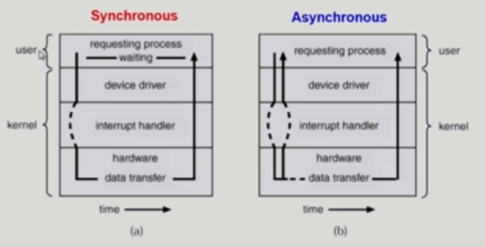
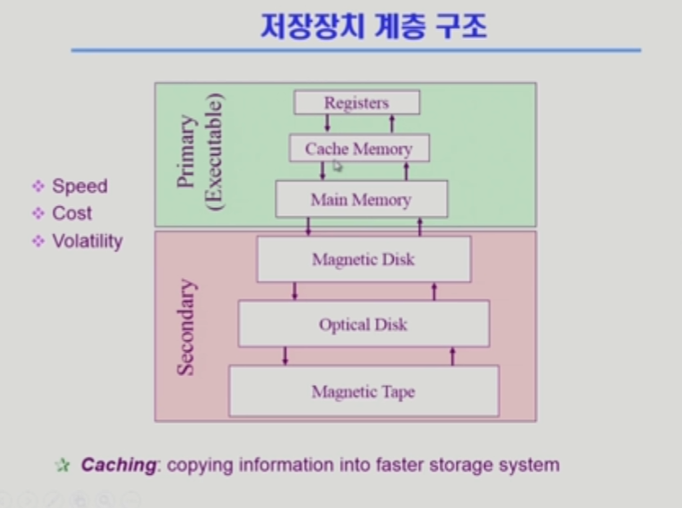

영상: [운영체제](http://www.kocw.net/home/search/kemView.do?kemId=1046323)

## [1 운영체제 개요](https://core.ewha.ac.kr/publicview/C0101020140307151724641842?vmode=f)

### 운영 체제란?

- 컴퓨터 하드웨어 바로 위에 설치되어 사용자 및 다른 모든 소프트웨어와 하드웨어를 연결하는 소프트웨어 계층

  - 협의의 운영체제(커널)

    - 운영체제의 핵슴 부분으로 메모리에 상주하는 부분

  - 광의의 운영체제

    - 커널 뿐 아니라 각종 주변 시스템 유틸리티를 포함한 개념

    

### 운영 체체의 목적

- 컴퓨터 시스템을 편리하게 사용할 수 있는 환경을 제공
- 컴퓨터 시스템의 **자원을 효율적으로 관리**
  - 리소스

### 운영 체제의 분류

- 동시 작업 가능 여부
  - 단일 작업
    - 한번에 하나의 작업만 처리

  - 다중 작업
    - 동시에 두개 이상의 작업 처리

- 사용자의 수
  - 단일 사용자
  - 다중 사용자

- 처리 방식
  - 일괄 처리
    - 모아서 한번에 처리

  - 시분할
    - 일정한 시간 단위로 분할하여 사용

  - 실시간
    - Deadline이 존재하여 반드시 종료됨이 보장되어야 함

### 몇 가지 용어

- Multitasking
- Multiprogramming
  - 여러 프로그램이 메모리에 올라가 있음

- Time sharing
  - CPU의 시간을 분할하여 나누어 쓴다

- Multiprocess
  - 하나의 컴퓨터에 CPU가 여러 개 붙어 있음을 의미

### 운영 체제의 예

- UNIX
- Windows

### 운영 체제의 구조

- CPU 스케줄링(CPU)
- 메모리 관리(메모리)
- 파일 관리 (디스크)
- 입출력 관리

## [2 시스템 구조 및 프로그램의 실행 Part-1](https://core.ewha.ac.kr/publicview/C0101020140311132925816476?vmode=f)

### 컴퓨터 시스템 구조

- Computer
  - CPU
    - 매 클럭 마다 instructions를 실행

  - Memory
    - memory controller
    - DMA controller

- I/O device
  - Disk
  - device controller
    - I/O device 내부 작은 cpu
    - 처리 완료, 신호를 통해 Interrupt 발생

### Mode bit

- 프로그램의 잘못된 수행으로 다른 프로그램 및 운영체제에 피해가 가지 않도록 하기 위한 보호 장치 필요
  - 1: 사용자 모드
  - 0: 모니터 모드

### Timer

- 정해진 시간이 흐른 뒤 운영체제에게 제어권이 넘어가도록 인터럽트를 발생시킴

  

### Device Controller

- I/O장치를 전담하는 작은 CPU
  - local buffer(data register)
  - controller

### [입출력과 인터럽트 (Input-Output and Interrupt)](/컴퓨터-구조/5장-기본-컴퓨터의-구조와-설계-Part2/입출력과-인터럽트.md)

### 시스템 콜 (System Call)

- 

## 인터럽트

* 인터럽트 당한 시점의 레지스터와 PC를 save 한 후 CPU의 제어를 인터럽트 처리 루틴에 넘긴다
* Trap
  * Exception
    * 프로그램 오류
  * system call
    * 프로그램이 커널 함수를 호출하는 경우

## [2 시스템 구조 및 프로그램의 실행 Part-2](https://core.ewha.ac.kr/publicview/C0101020140314151238067290?vmode=f)

### 동기식 입출력과 비동기식 입출력

- 동기식 입출력

  - I/O 요청 후 입출력 작업이 완료된 후에야 제어가 사용자 프로그램에 넘어감

  - 구현 방법 1

    I/O가 끝날 때까지 CPU를 낭비시킴

    매시점 하나의 I/O만 일어날 수 있음

  - 구현 방법 2

    I/O가 완료될 때까지 해당 프로그램에게서 CPU를 빼앗음

    I/O 처리를 기다리는 줄에 그 프로그램을 줄 세움

    다른 프로그램에게 CPU를 줌

* 비동기식 입출력
  * I/O가 시작된 후 입출력 작업이 끝나기를 기다리지 않고 제어가 사용자 프로그램에 즉시 넘어감

### DMA (Direct Memory Access)

- 빠른 입출력 장치를 메모리에 가까운 속도로 처리하기 위해 사용
- CPU의 중재 없이 device controller가 device의 buffer storage의 내용을 메모리에 block 단위로 직접 전송
- 바이트 단위가 아니라 block 단위로 인터럽트를 발생시킴

### 서로 다른 입출력 명령어

- I/O를 수행하는 special instruction에 의해
- Memory Mapped I/O에 의해

### 저장장치 계층 구조

- [12장 메모리 구조](/컴퓨터-구조/12장-메모리-구조.md) 

  

### 프로그램의 실행 (메모리 load)

- File system -> Virtual memory -> Physical memory
- Virtual memory (자신만의 독자적인 주소, 메모리)
  - stack
    - 함수 호출, return

  - data
    - 변수
    - 자료구조

  - code

### 커널 주소 공간의 내용

- code
  - 시스템콜, 인터럽트 처리 코드
  - 자원 관리를 위한 코드
  - 편리한 서비스 제공을 위한 코드

- data
  - PCB, CPU, mem, disk 각 영역에 대해 관리하기 위한 자료구조 생성

- stack
  - 각 Process에 대한 커널 스택

### 사용자 프로그램이 사용하는 함수

-