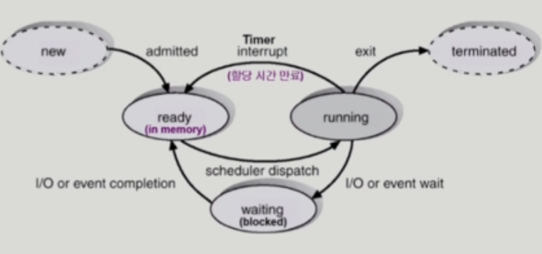

## [프로세스 #1](https://core.ewha.ac.kr/publicview/C0101020140318134023355997?vmode=f)

### 프로세스의 개념

- 프로세스의 문맥

  - CPU 수행 상태를 나타내는 하드웨어 문맥

    - PC
    - register

  - 프로세스의 주소 공간

    - code, data, stack

  - 프로세스 관련 커널 자료 구조

    - PCB
    - Kernel stack

    

### 프로세스의  상태 (Process State)

> 프로세스의 상태는 변경되며 수행된다.

* Running

  * instruction을 수행중인 상태 CPU를 잡고

* Ready

  * CPU를 기다리는 상태

* Blocked

  * CPU를 주어도 당장 instruction을 수행할 수 없는 상태
  * Process 자신이 요청한 event가 즉시 만족되지 않아 이를 기다리는 상태
  * ex) 디스크에서 file을 읽어와야 하는 경우

* New

  *  프로세스가 생성중인 상태

* Terminated

  * 수행이 끝난 상태

    

### Process Control Block(PCB)

> 운영체제가 각 프로세스를 관리하기 위해 프로세스당 유지하는 정보

### 구성 요소

* OS가 관리상 사용하는 정보
* CPU 수행 관련 하드웨어 값
* 메모리 관련
* 파일 관련

### 문맥 교환 (Context Switch)

- CPU를 한 프로세스에서 다른 프로세스로 넘겨주는 과정
- CPU가 다른 프로세스에게 넘어갈 때 운영체제는 다음을 수행
  - CPU를 내어주는 프로세스의 상태를 그 프로세스의 PCB에 저장
  - CPU를 새롭게 얻는 프로세스의 상태를 PCB에서 읽어옴

:exclamation: System call이나 interrupt 발생시 반드시 context switch가 일어나진 않음

* timer, I/O 요청 system call에서 일어남

### 프로세스를 스케줄링하기 위한 큐

- Job queue

  - 현재 시스템 내에 있는 모든 프로세스의 집합

- Ready queue

  - 현재 메모리 내에 있으면서 CPU를 잡아서 실행되기를 기다리는 프로세스의 집합

- Device queue

  - I/O device의 처리를 기다리는 프로세스의 집합

  

### 스케줄러 (Scheduler)

* Long-term scheduler

  * 시작 프로세스중 어떤 것들을 ready queue로 보낼지 결정

  * 프로세스에 각종 자원을 주는 문제

  * degree of Multiprogramming을 제어

  * **time sharing system**에는 보통 장기 스케줄러가 없음

    

* Short-term scheduler

  * 어떤 프로세스를 다음번에 **running** 시킬지 결정
  * 프로세스에 **CPU**를 주는 문제
  * 충분히 빨라야 함

* Medium-term scheduler

  * **여유 공간 마련을 위해 프로세스를 통째로 메모리에서 디스크로 쫓아냄**

    

## [프로세스 #2](https://core.ewha.ac.kr/publicview/C0101020140321141759959993?vmode=f)

### 질문 답변 > [1, 2장 운영체제 개요 및 컴퓨터시스템의 구조](/운영체제/1,-2장-운영체제-개요-및-컴퓨터시스템의-구조.md)

### Thread

#### 구성

* PC
* register set
* stack space

#### 동료 thread와 공유하는 부분

*  code section
* data section
* OS resources

> 다중 스레드로 구성된 태스크 구조의 경우, block 상태인 경우 다른 스레드가 실행하여 빠른 처리가 가능하다.

## 프로세스 #3

### Single and Multithreaded Processes

- 

### Benefits of Threads

- 응답성
  - 하나가 block된 경우 다른 스레드 들이 진행

- 자원 공유
  - binart code, data, 프로세스들의 자원들을 공유 할 수 있음

- 경제성
  - 프로세스를 생성하고 CPU 스위칭 하는것보다 스레드하나를 생성하고 CPU 스위칭 하는것이 더 빠르다.

- 유연성
  - 각 스레드는 다른 프로세서에서 병렬적으로 작업

### Implementation of Threads

> 커널 스레드
>
> * 스레드 여러개 있다는것을 운영체제가 알고 있음
>
> 유저 스레드
>
> * 라이브러리를 통해 지원
> * 