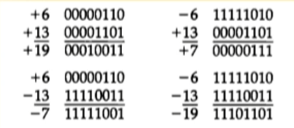

## [제 3장 Part-1](https://www.youtube.com/watch?v=aSocCv3SC2k&list=PLc8fQ-m7b1hCHTT7VH2oo0Ng7Et096dYc&index=6)

### 데이터의 종류 (Data Types)

> 산술 연산용 숫자 (Numeric)
>
> 데이터 처리용 영문자(Alpha)
>
> 특수 목적용 기호 (Special)

#### 진수와 진법 (Numeric)

* radix
* Decimal
* Binary
* Octal
* Hexadecimal

#### 영숫자의 표시(Alpha)

* ASCII Code: 7bits
* EBCDIC Code: 16bitx
* UniCode: 16bits/32bits

#### Special

* Morse Code
* Flag Signal

 

### 보수 (Complements)

> 진법의 기수 r에 대응하는 역 값
>
> 뺄셈과 논리 계산에 사용

## [제 3장 Part-2](https://www.youtube.com/watch?v=bysGzutpRgc&list=PLc8fQ-m7b1hCHTT7VH2oo0Ng7Et096dYc&index=7)

### 고정 소수점 표현 (Fixed Point Representation)

> 소수점의 위치를 결정하여 숫자 표현
>
> 레지스터 비트에 소수점 위치를 표시

* 16bit 정수의 경우 최우측에 소수점 자리 위치
* 부동소수점의 경우, 레지스터 비트 중간에 소수점 자리 위치

### 정수의 표현 (-14)

* MSB로 부호 표현
  * 양수는 MSB -> 0, 음수는 MSB -> 1

### 산술 가산

#### 문제점

* 오버플로우의 발생
  * 자리 올림에서 문제가 발생
  * 같은 부호의 경우에만 발생
* 처리 방법
  * 오버 플로우 발생을 미리 확인
  * 연산을 처리하지 않고 인터럽트 또는 에러 처리

### 부동 소수점 표현 (Floating Point Representation)

* IEEE 754

  * 가수와 지수로 표현
  * 가수: 분수, 정수값 표시
  * 지수: 십진/이진 소수점 위치를 표시

  > 0 10000100 00111000000000000000000000000000
  >
  > 부호, 지수, 가수

### 기타 이진 코드 (Other Binary Codes)

- Grey Code
  - 한 숫자에서 다음 숫자로 변할 때 한 비트만 변동 ( 낮은 에러 발생률 )
  - 제어 계통에 주로 사용

- BCD Code
  - 10진수에 대한 2진수 표현
  - 4bit를 사용 0~9까지 사용

- Excess-3 Code
  - BCD Cpde + 0011
  - 암호 교신 코드

- 기타 영문 code
  - ASCII
  - EBCDIC

### 에러 검출 코드 (Error Detection Codes)

* Parity bit
  * 외부 잡음에 의한 에러 검출
  * 송신측은 패리티 발생, 수신측은 패리티 검사를 실시한다.