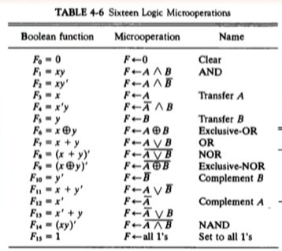

## [제 4장 Part-1](https://www.youtube.com/watch?v=LDjco5XJH1E&list=PLc8fQ-m7b1hCHTT7VH2oo0Ng7Et096dYc&index=8)

### 레지스터 전송 언어 (Register Transfer Language)

- 마이크로연산
  - 레지스터에 저장된 데이터를 가지고 실행되는 동작

- 레지스터 전송 언어
  - 마이크로연산, 전송을 명료하게 표시하기 위하여 사용하는 기호

- 레지스터 전송 언어 규칙
  - 모든 레지스터의 이름은 대문자로 표시
  - 레지스터 가장 왼쪽 FF -> MSB 가장 오른쪽 -> LSB
  - 16비트 PC 레지스터의 경우,
    - 상위(8~15) : PC(H)
    - 하위(0~7) : PC(L)

### 레지스터 전송 (Register Transfer)

#### 레지스터 정보 전송

* 치환 연산자 사용

  R2 <- R1

* 제어 조건이 있을 경우
  * 조건문 적용
* 제어 함수로 표현할 경우
  * 삼항 조건문 적용

#### 레지스터 전송의 기본 기호

* Register data exchange
  * T: R2 <- R1, R1 <- R2

### 버스와 메모리 전송 (Bus and Memory Transfers)

#### 공통 버스

* 레지스터들 사이의 전송 통로
* 한 번에 하나의 신호만 전송하도록 제어 ( 충돌 위험이 있음 )
* 멀티플렉서를 사용하여 레지스터 선택

#### 3-상태 버퍼

* 멀티 플렉서 대신 사용하여 버스 구성 가능
* 3개의 상태로 동작
  * 0 : 정상적인 버퍼로 동작
  * 1 : 정상적인 버퍼로 동작
  * 고저항 상태: 출력 차단

#### 메모리 전송

* Read: DR <- M[AR]
* Write: M[AR] <- R1

#### 마이크로 연산의 분류

* 레지스터 전송 마이크로 연산

  * 레지스터간 이진 정보 전송

* 산술 마이크로 연산

  * 수치 데이터에 대한 산술 연산

  > 1 증가, 1 감소가 덧셈, 뺄셈을 의미하지 않는다.

* 논리 마이크로 연산

  * 비수치 데이터에 대한 비트 조작 연산

* 시프트 마이크로 연산

  * 데이터에 대한 시프트 연산

#### 이진 가산기

* 여러 개의 전가산기를 연결

#### 이진 감가산기

* 보수를 만드는 게이트와 신호 사용
  * M -> 0: 가산
  * M -> 1 : 감산

#### 산술 회로

* 4개의 전가산기
* 4개의 멀티플렉서
* 2개의 4비트 입력
* 1개의 출력
* 3개의 제어 라인

## [제 4장 Part-2](https://www.youtube.com/watch?v=IUapFpDKhKI&list=PLc8fQ-m7b1hCHTT7VH2oo0Ng7Et096dYc&index=9)

### 산술 마이크로 연산 (Arithmetic Micro-operations)

- 

### 논리 마이크로 연산 (Logic Micro-operations)

>F_0 ~  F_15 총 16가지의 코드로 연산을 결정 짓는다.
>
>각 코드마다 정해진 처리 연산이 있다.

### 시프트 마이크로 연산 (Shift Micro-operations)

#### 논리 시프트

* 직렬 입력으로 0이 전송
  * R1
    * shl(R1): 왼쪽으로 쉬프트
  * R2
    * shr(R2): 오른쪽으로 쉬프트

#### 순환 시프트

* 직렬 출력이 직렬 입력으로 전송
  * R_0 -> R_n-1 로 옮겨가는 현상
  * 논리 시프트와 구분하기 위해 cir, cil로 표현

#### 산술 시프트

* 부호 비트를 제외하고 시프트
* 왼쪽 시프트 : 2배
* 오른쪽 시프트 : / 2

### 산술 논리 시프트 장치 (Arthmetic-Logic Shift Unit)

-