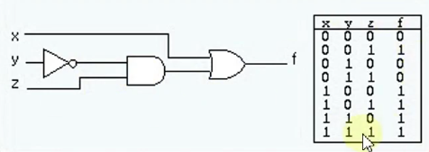
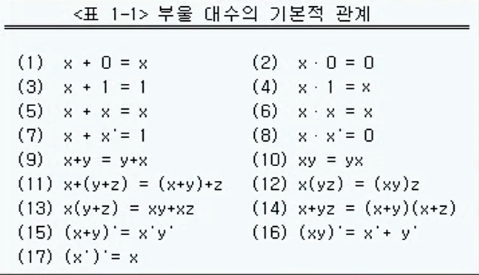
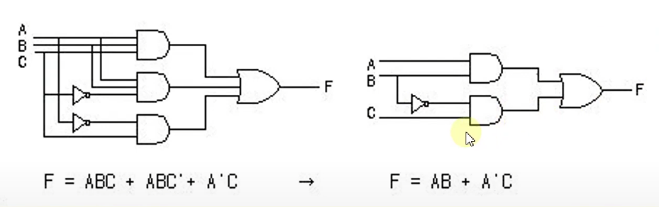
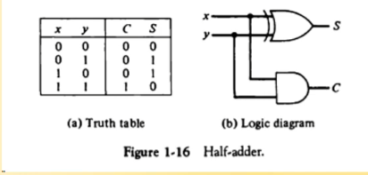
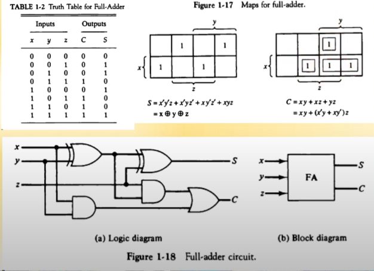
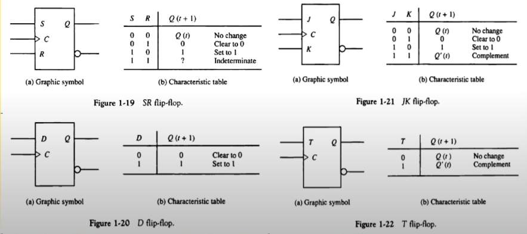
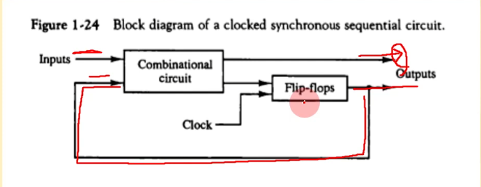
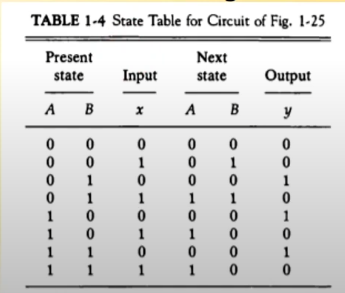
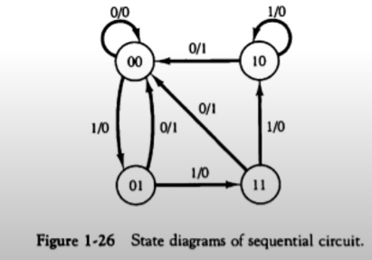

영상: [CSA2021 컴퓨터시스템구조](https://www.youtube.com/playlist?list=PLc8fQ-m7b1hCHTT7VH2oo0Ng7Et096dYc)

## 강의 소개
- 디지털 논리회로에 대해서 배운다! 🖥

## [제 1장 Part-1](https://www.youtube.com/watch?v=SG89LOgT7Vc&list=PLc8fQ-m7b1hCHTT7VH2oo0Ng7Et096dYc&index=2)

### 디지털 컴퓨터(Digitial Computer)

- 정의

  - 이진 시스템을 사용하여 계산을 수행하는 디지털 시스템
  - 비트의 그룹을 사용하여 숫자, 문자 및 기타 정보를 표시하거나 처리

- 컴퓨터 하드웨어

  - CPU : 중앙처리장치. 컴퓨터 그 자체로 정의. 산술 논리 처리와 데이터의 저장, 제어 기능 수행

    > CPU가 컴퓨터 그 자체임!! 나머지는 CPU를 보조하는 기본 유닛들

  - 주변장치 : 메모리(RAM/ROM), 저장장치(Storage), 입출력 장치(IO device)

- 컴퓨터 소프트웨어

  - 운영체제 (OS - Operating System)
  - 시스템 프로그램
    - 유틸리티, 데이터베이스, Editor
    - OS에 포함되거나 연결되어 시스템 운영을 보조

  - 응용 프로그램

### 논리 게이트(Logic Gates)
- 이진 정보의 표시

  - 0과 1의 전압 신호 (0V - 5V or 0.5 - 3V 시스템)

- 논리 게이트 

  > 0과 1의 입력신호를 가지고 논리식을 만들 수 있다! 이 논리식을 논리 게이트의 조합으로 만듦

  - 기본 게이트

    

  - 진리표로 동작 정의

### [부울 대수(Boolean Algebra)](/이산-수학/명제,추론,귀납,부울대수/부울-대수.md)

- 이진 변수와 논리 동작을 취급하는 대수

- 기본 대수 동작 : AND, OR, NOT

- 부울 대수의 예

  F = x + y'z

  

- 부울 대수의 사용 이유

  - 변수 사이의 진리표 관계를 대수적으로 표시
  - 논리도의 입출력 관계를 대수 형식으로 표시
  - 같은 기능을 가진 더 간단한 회로 발견

- 부울 대수의 기본 관계

  - 항등원

  - 역원

  - 교환법칙

  - 결합법칙

  - 드모르강의 법칙

    

- 부울 대수의 간략화와 등가 회로

  - F = ABC + ABC' + A'C = AB(C+C') + A'C

    

- 부울 대수의 보수

  - F = AB + C'D' + B'D => F' = (A' + B')(C + D)(B + D')

### 맵의 간소화 (Karnaugh Map)
- [4강 동치 관계](/이산-수학/이산수학-기초/동치-관계.md)

> 부울 함수를 visual diagram을 통하여 간소화시킨다!

- Karnaugh map, Veitch diagram

  > [카르노맵 발표자료]

- Minterm, Maxterm을 이용한 간소화

## [제 1장 Part-2](https://www.youtube.com/watch?v=gn5z3Un_qqM&list=PLc8fQ-m7b1hCHTT7VH2oo0Ng7Et096dYc&index=3)

### 조합회로 (Combinational Circuit)
- 입력과 출력을 가진 논리 게이트(AND, OR, NOT ...)의 집합

- 출력이 값은 입력의 0, 1 조합에 의하여 결정되는 함수의 결과로 표시

- n개의 입력 조합이 있을 경우 가능한 입력 조합 : 2^n 가지

- 조합 회로의 설계 절차

  1) 해결할 문제의 제시
  2) 입력과 출력의 변수에 문자 기호 부여
  3) 입력-출력 관계를 정의하는 진리표 도출
  4) 각 출력에 대한 간소화된 부울 함수 도출
  5) 부울 함수에 대한 논리도 작성
  6) 논리도를 바탕으로 회로 구현

- 조합 회로의 예시

  - 반가산기 : 2개의 비트 값을 산술적으로 가산

    S = x'y + xy' = x XOR y

    C = xy

    

  - 전가산기 : 캐리값을 포함하여 3티브 가산

    S = x XOR y XOR z

    C = xy + (x XOR y)z

    

### 플립플롭 (Flip-Flop)

- **정의**

  - 1비트의 디지털 정보를 저장하는 이진 셀(디지털 메모리)

  - 동기식 순차회로의 기본적인 요소로 사용, 조합회로와 함께 순차회로를 구성

  - 입력의 상태가 변화를 일으키기 전까지는 이전의 출력 상태를 그대로 유지

    - 플립플롭의 종류

      - SR - 플립플롭

      - D - 플립플롭

      - JK - 플립플롭

      - T - 플립플롭

        

- 모서리-변이형 플립플롭 (Edge-triggered FF)

  >  입력값의 변화 모서리에서만 동작

  - Upward triggered FF : 입력값이 상향일 경우에만 동작 (0 -> 1)
  - Downward triggered FF : 입력값이 하향일 경우에만 동작 (1 -> 0)

  > 올바른 동작을 위해서는 최소의 신호 유지 시간이 필요하다!
  >
  > Setup time : 출력 변화를 위하여 입력이 유지되어야 하는 최소 시간
  >
  > Hold time : 출력 유지를 위하여 입력이 바뀌지 않아야 하는 최소 시간

### 순차회로 (Sequential Circuit)

- **정의**

  - 플립플롭과 게이트(또는 조합회로)를 서로 연결한 회로

  - 클럭펄스에 의하여 동기화된 입력 순차에 의하여 제어

  - 출력은 외부 입력과 플립플롭의 현 상태의 함수로 표시

- 플립플롭의 입력식

  > 순차회로를 분석할 때에는  플립플롭에 어떠한 입력 신호가 들어가는 가! ( = 플립플롭의 입력식 만들기)가 가장 중요함!!

  - FF의 입력을 만들어 내는 조합 회로 부분

  - 부울 수식에 의하여 표현

    ex) 

    D(A) = Ax + Bx

    D(B) = A'x

    y = Ax' + Bx'

  - 상태표

    

  - 상태도

    