## [제 2장 Part-1](https://www.youtube.com/watch?v=aj74NlGUAk4&list=PLc8fQ-m7b1hCHTT7VH2oo0Ng7Et096dYc&index=4)

### 집적회로 (Integrated Circuits)

##### 정의

- 디지털 게이트를 구성하는 전자 부품을 포함하는 실리콘 반도체 칩
- 칩 내부에 게이트들이 연결되고, 외부로도 연결
- 칩의 등록 번호로 구분

##### 집적 규모에 따른 분류

- SSI : 소규모 10개 이하의 게이트들로 구성 
- MSI : 중규모, 10~200개의 게이트들로 디코더, 가산기, 레지스터 구현
- LSI : 대규모, 200~1000개의 게이트들로 프로세서나 메모리 칩과 같은 디지털 시스템 형성
- VLSI : 초대규모, 수천개 이상의 게이트 집적, 대형 메모리나 마이크로컴퓨터 칩 구성

##### 디지털 논리군에 따른 분류

- TTL(Transister-Transistor Logic) : 일반 로직 회로 부품
- ECL(Emitter-Coupled Logic) : 고속 논리 시스템용 부품(1~2ns 이하), 슈퍼컴퓨터용
- MOS(Motel Oxide Semiconductor) : 고밀도 집적회로용 부품 
  - N형 반도체를 바닥에 깔고 만들기 때문에, 항상 + 전원이 필요해서 **전력소모가 큼**.
- CMOS(Complement Metal Oxide Semiconductor) : 고밀도 회로, 단순한 제조공정, 저전력 특성
  - 바닥에 접지를 깔고, Complement 형태의 P형 반도체로 회로를 만듦. 항상 전력이 들어갈 필요가 없어서 **전력 소모가 적다**. -> 휴대폰 같은 배터리가 중요한 기계에 주로 사용됨!

### 디코더 (Decoders)

##### 정의 : N 비트의 이진 정보를 서로 다른 2^N 개의 원소 정보로 출력

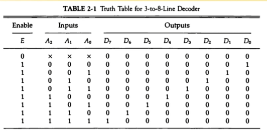

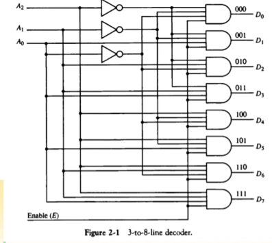

여러 기계 중에 하나만 고를 때 보통 사용 됨

##### NAND 게이트로 이루어진 디코더

- 보수화된 출력이 더 경제적이다! 
  - (CMOS가 0인 신호가 전력을 사용함. 1인 신호를 유지하는게 유리하다.)
- 대부분의 출력신호가 1로 유지
- CMOS 회로의 영향으로 저전력 회로에 유리

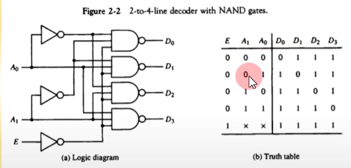

##### 인코더

- 디코더와 반대 동작 수행
- 2^N의 입력에 대하여 N 이진 코드 출력
- 한번에 하나의 입력만이 1의 값을 가질 수 있음.

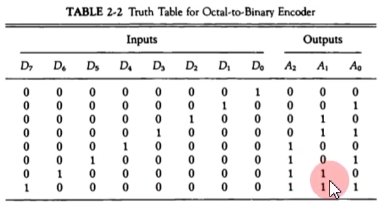

### 멀티플렉서 (Multiplexers)

##### 정의 

- N개의 선택 입력에 따라서 2^N개의 출력을 하나의 출력에 선택적으로 연결
- 다중 입력 중 하나를 선택하여 출력으로 연결
- 네트워크 스위치(전화, LAN, WAN)의 기본 구조 요소
  - 여러개의 입력들이 들어오는데, 그 중 특정한 곳으로만 보내주는 스위치 기능!!

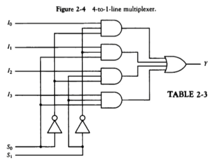

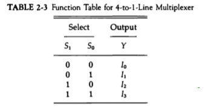

### 레지스터 (Registers)

N비트의 데이터를 저장하는 기능을 가지는 반도체 소자로 구성된 단위 논리 집단

##### 레지스터의 구성

- N비트 레지스터 : N비트의 이진 정보 저장
- N개의 플립플롭과 조합 회로로 구성

##### 기본 레지스터

- 클럭펄스 타이밍에 입력값이 레지스터에 저장 (클럭 펄스에 동기화 됨!)
- 레지스터에 저장된 값은 항상 출력에서 참조 가능
- Clear, Clock 입력 제공

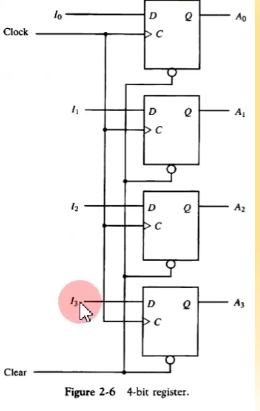

I0, I1 ... 에 어떤 입력이 있을 때, 클럭 펄스가 들어가면 바로 I의 값들이 D 플립플롭의 출력으로 반영이 된다.

##### 병렬로드 가능한 4비트 레지스터

- 4비트의 데이터를 동시에 입력 가능
- Load, Clock 제공

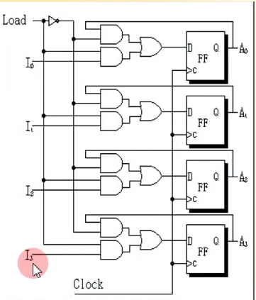

Load 라는 입력이 1이 되지 않으면 클럭 펄스가 있더라도, I의 값들이 D 플립플롭의 출력으로 반영이 되지 않는다. Load 입력이 1일때만 저장이 가능함! (그림엔 없지만 Clear는 모두 존재한다. 마찬가지로 순차회로면 Clock이 그려져 있지 않아도 존재함!)

## [제 2장 Part-2](https://www.youtube.com/watch?v=7VPjQMeiHg0&list=PLc8fQ-m7b1hCHTT7VH2oo0Ng7Et096dYc&index=5)

### 시프트 레지스터 (Shift Registers)

##### 정의 

- 레지스터에 저장된 이진 정보를 단방향 / 양방향으로 이동 가능한 레지스터 (클럭펄스가 들어올 때마다)
- 각 FF들의 입력이 출력과 cascade로 연결
- 공통 clock이 다음 상태로의 이동 제어

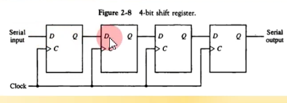

##### 병렬 로드를 가지는 양방향 시프트 레지스터(General Register)

- 병렬로드, 왼쪽 / 오른쪽 시프트, 병렬 출력 기능
- 동기화된 clock에 의하여 동작
- 범용 레지스터르 지칭

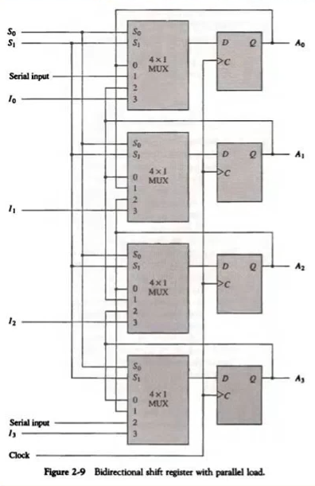

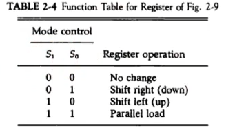

### 이진 카운터 (Binary Counters)

값 자체가 정해진 순서대로 상태(출력값) 변이가 수행되는 레지스터!

##### 정의

- 정해진 순서대로 상태 변이 수행
- Clock, 또는 외부 입력에 따른 상태 변이
- 용도
  - 사건의 발생 횟수 카운트
  - 동작 순서 제어 타이밍 신호 발생에 적용

##### 병렬 입력을 가진 이진 카운터

- 카운터의 초기값 설정 가능
- 병렬 입력을 통하여 초기값 로드
- Load, Clear, Increment 기능

### 메모리 장치 (Memory Unit)

##### 정의 

- 정보의 입출력 기능을 가지는 저장 요소들의 집합
- Word 단위로 정볼르 저장
- Word : 입출력에서 하나의 단위로 취급되는 비트의 그룹
  - 16bit 컴퓨터 : 레지스터 / 메모리 버스의 크기가 16bit(2byte)
  - 64bit 컴퓨터 : 레지스터 / 메모리 버스의 크기가 64bit(8byte)

- Byte : 워드의 기본 단위
- MB, GB, PB

##### RAM(Random Access Memory)

- Word의 물리적인 위치에 관계 없이(메모리가 어떤 번지에 있던지 간에) 데이터 접근
- 모든 데이터 위치에 대하여 동일한 접근 시간
- N 비트의 입력 / 출력 (word 크기와 동일)
- K 개의 주소 라인으로 2^K개 word중 하나를 선택
- 읽기 / 쓰기 지정 (R/W)

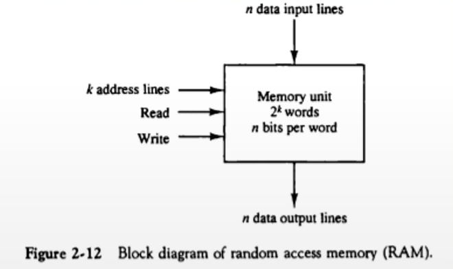

##### ROM(Read Only Memory)

- 한번 저장된 데이터를 읽기만 가능
- 1 word가 N 비트이고, M 워드를 저장하는 N x M ROM
- ROM에 저장된 M word를 접근할 수 있는 K 개의 주소입력 (2^K = M)

##### ROM의 종류

- Mask ROM : 석판화(Lithography) 방식으로 구워져 나오는 ROM (처음부터 찍혀나옴, 바꿀수도 지울수도 없음!)
- PROM : 한번만 프로그램 가능 (초기화 된 상태에서 한번만 데이터를 쓸 수 있음 -> 그 이후엔 Mask ROM과 같다)
- EPROM : UV에 의한 데이터 삭제(ROM 초기화) 및 재프로그래밍 가능 (시간이 오래 걸림)
- EEPROM : 전기 신호에 의한 데이터 삭제 / 초기화 및 재프로그래밍 (시간이 빠르다)

##### ROM의 기능을 하는 RAM (쓸 수 있는 경우는 반드시 특별한 신호가 있는 경우에만 가능하다!)

- Flash-RAM : BIOS, USB memory, SD card
- NV-RAM
  - Non-Volatile RAM
  - Battery Backup RAM