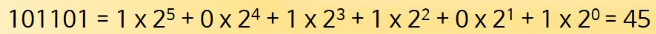
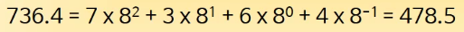
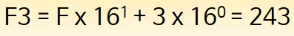
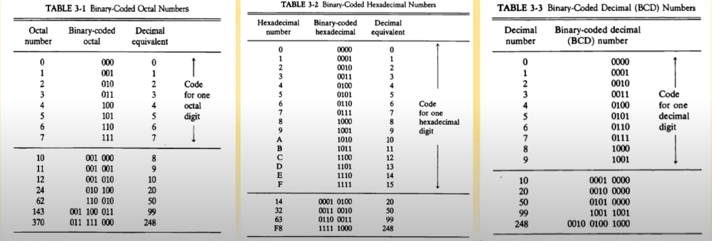
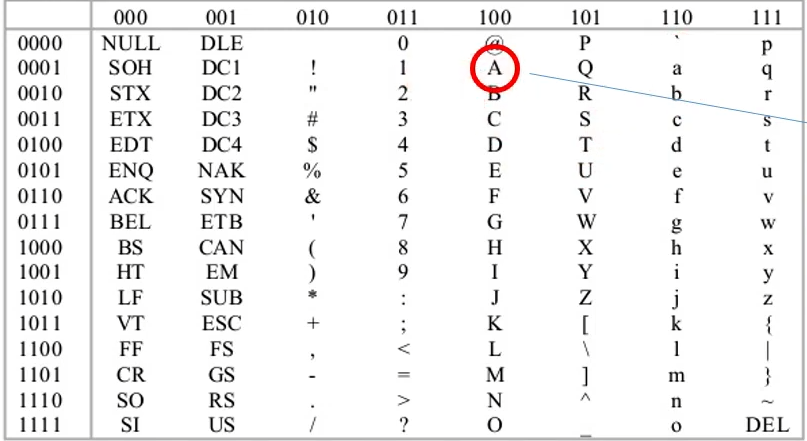

## [제 3장 Part-1](https://www.youtube.com/watch?v=aSocCv3SC2k&list=PLc8fQ-m7b1hCHTT7VH2oo0Ng7Et096dYc&index=6)

### 데이터의 종류 (Data Types)

##### 컴퓨터 레지스터에서 쓰이는 데이터의 종류

- 산술 연산용 숫자(Numeric)
- 데이터 처리용 영문자(Alpha)
- 특수 목적용 기호(Special)

##### 진수와 진법

- radix : 진법의 기수에 해당(10, 2, 8, 16 ...)
- 10진수 :  
- 2진수 : 
- 8진수 : 
- 16진수 : 

##### 2진화 8진수 / 2진화 16진수 / 2진화 10진수

 

##### 영숫자의 표시

- ASCII Code : 7bits (+1 parity bit)
  

  알파벳 대문자는 은 100 부터 ex) 'A' : 100 0001 

  숫자는 011 부터!

- EBCDIC Code : 16bits, IBM internal code
- UniCode : 16bits / 32bits
  - 영문자나 숫자는 동일 
    - UTF-16 : A - 00000000 01000001,
    - UTF-32 : A - 00000000 00000000 00000000 01000001
  - 다른 국가들의 언어를 표현하기 위해서 앞에 bit를 더 붙인 것

##### 특별한 신호들

- 모스 부호(Morse Code)
  - SOS : . . . - - - . . .
- 깃발 신호(Red/White flags)

### 보수 (Complements)

##### 정의 

- 진법의 기수 r에 대응하는 역(reverse) 값
- 뺄셈과 논리 계산에 사용

##### (r-1)의 보수 체계 

- 9's complement 99999 - 12389 = 87610
- 1's complement 1111111 - 0001111 = 1110000

##### (r)의 보수 체계

- 10's complement 100000 - 12389 = 87611
- 2's complement 10000000 - 0001111 = 1110001

컴퓨터는 뺄셈이라는 연산을 하지 않는다. 다른 연산들도 없다. 덧셈밖에 없음! 모든 연산을 덧셈을 이용해서 처리하는 것.

이 보수를 이용하여 뺄셈을 덧셈으로 수행한다!

## [제 3장 Part-2](https://www.youtube.com/watch?v=bysGzutpRgc&list=PLc8fQ-m7b1hCHTT7VH2oo0Ng7Et096dYc&index=7)

### 고정 소수점 표현 (Fixed Point Representation)

- 

### 부동 소수점 표현 (Floating Point Representation)

- 

### 기타 이진 코드 (Other Binary Codes)

- 

### 에러 검출 코드 (Error Detection Codes)

-