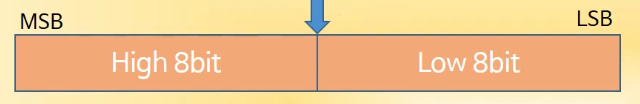
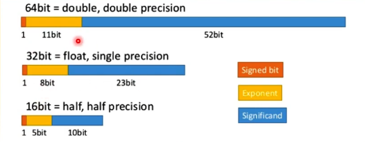
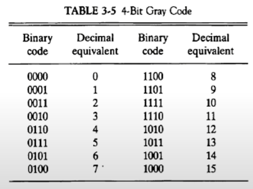
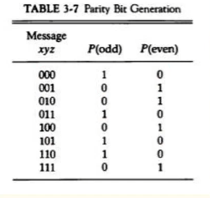

## [제 3장 Part-1](https://www.youtube.com/watch?v=aSocCv3SC2k&list=PLc8fQ-m7b1hCHTT7VH2oo0Ng7Et096dYc&index=6)

### 데이터의 종류 (Data Types)

##### 컴퓨터 레지스터에서 쓰이는 데이터의 종류

- 산술 연산용 숫자(Numeric)
- 데이터 처리용 영문자(Alpha)
- 특수 목적용 기호(Special)

##### 진수와 진법

- radix : 진법의 기수에 해당(10, 2, 8, 16 ...)
- 10진수 :  
- 2진수 : 
- 8진수 : 
- 16진수 : 

##### 2진화 8진수 / 2진화 16진수 / 2진화 10진수

 

##### 영숫자의 표시

- ASCII Code : 7bits (+1 parity bit)
  

  알파벳 대문자는 은 100 부터 ex) 'A' : 100 0001 

  숫자는 011 부터!

- EBCDIC Code : 16bits, IBM internal code
- UniCode : 16bits / 32bits
  - 영문자나 숫자는 동일 
    - UTF-16 : A - 00000000 01000001,
    - UTF-32 : A - 00000000 00000000 00000000 01000001
  - 다른 국가들의 언어를 표현하기 위해서 앞에 bit를 더 붙인 것

##### 특별한 신호들

- 모스 부호(Morse Code)
  - SOS : . . . - - - . . .
- 깃발 신호(Red/White flags)

### 보수 (Complements)

##### 정의 

- 진법의 기수 r에 대응하는 역(reverse) 값
- 뺄셈과 논리 계산에 사용

##### (r-1)의 보수 체계 

- 9's complement 99999 - 12389 = 87610
- 1's complement 1111111 - 0001111 = 1110000

##### (r)의 보수 체계

- 10's complement 100000 - 12389 = 87611
- 2's complement 10000000 - 0001111 = 1110001

컴퓨터는 뺄셈이라는 연산을 하지 않는다. 다른 연산들도 없다. 덧셈밖에 없음! 모든 연산을 덧셈을 이용해서 처리하는 것.

이 보수를 이용하여 뺄셈을 덧셈으로 수행한다!

## [제 3장 Part-2](https://www.youtube.com/watch?v=bysGzutpRgc&list=PLc8fQ-m7b1hCHTT7VH2oo0Ng7Et096dYc&index=7)

실제로 컴퓨터의 레지스터에는 어떤 식으로 데이터를 표현하느냐?

숫자는 고정소수점(정수) 와 부동소수점(실수) 가 있다!

### 고정 소수점 표현 (Fixed Point Representation)

##### 정의

- 소수점의 위치를 결정하여 숫자 표현

- 레지스터 비트에 소수점 위치를 표시

  

- 16bit 정수의 경우 최우측(LSB)에 소수점 자리 위치

- 부동소수점의 경우, 레지스터 비트 앞/중간에 소수점 자리 위치

##### 정수의 표현(-14)

- MSB(Most Significant Bit)로 부호 표현
- 양수는 MSB -> 0, 음수는 MSB -> 1
- 부호 절대값 표현 : 1 000 1110
- 부호화된 1의 보수 : 1 111 0001
- 부호화된 2의 보수 : 1 111 0010 (대부분의 컴퓨터, CPU에서 사용! 대부)

##### 오버플로우 발생

- N자리의 두 수를 더하여 N+1자리의 합이 발생하였을 때
- 가수, 피가수의 부호와 관계없이 발생
- 정해진 레지스터의 비트수로 인한 문제
  - 종이와 연필로 연산할 경우 절대 발생되지 않을 상황
  - 정해진 비트 수내에서만 연산이 가능한 컴퓨터에서 발생

##### 오버플로우 발생 상황

- 연산 결과 값이 레지스터의 비트수를 초과할 경우 발생
- 두 수의 부호가 같을 경우에만 발생 (다르면 값이 줄어드니까 절대 발생하지 않음)
- 레지스터에 저장된 연산 결과값은 잘못된 값으로 저장

##### 오버플로우 처리 방법

- 오버플로우 발생을 미리 확인
  - MSB 두 **캐리** 비트의 값이 서로 다르면 오버플로우
  - if C8 XOR C7 = 1, Overflow occurs
- 연산을 처리하지 않고 인터럽트 또는 에러 처리

### 부동 소수점 표현 (Floating Point Representation)

##### 부동소수점 표시방법(IEEE 754)

- 가수와 지수로 표현
- 가수(mantissa) : 분수(Fraction), 정수값 표시
- 지수(Component) : 십진/이진 소수점 위치를 표시

ex) +1001.11 -> 분수 : 01001110 / 지수 : 000100 => +(.1001110) * 2^4

=> 32bit FP 표현 예 : **0**(부호) **1**(128 biased) **0000100** (지수) **001110**(분수) **00000000000000000**

-분수에서 가장 좌측의 1은 제외한다! 어차피 무조건 1이기 때문에. 이를 줄임으로써 1bit를 더 사용 가능 함!

=> 소수부분이 얼마나 더 기냐에 따라 정밀도가 높아진다 => 소수점 이하의 숫자가 그리 많지 않은 경우, 굳이 double로 사용할 필요가 없다! 변수가 차지하는 메모리의 크기가 커짐! 메모리 낭비! 

=> 실수를 사용할 때 무조건 float이나 double을 사용해야 하는 것은 아니다. long이나 short로도 표현 가능. 반대로 정수라도 float이나 double로 표현 가능하다. double을 사용하면 64bit로 정수를 나타낸다는 뜻!

 

##### 정규화(Normalization)

- 부동소수점 숫자에서 최상위 비트가 0이 아닌 경우
- 0이 있을 경우, Mantissa의 소수점 위치 이동
- 이동한 만큼, exponent의 값 변경

### 기타 이진 코드 (Other Binary Codes)

- Grey Code

  - 한 숫자에서 다음 숫자로 변할 때 한 비트만 변동

  - 제어 계통에 주로 사용

  - 여러 전기 신호가 동시에 바뀔 때 낮은 에러 발생률

    

- BCD Code

  - 10진수에 대한 2진수 표현
  - 4bit를 사용 0~9까지 사용(0000 ~ 1001)

- Excess-3 Code

  - BCD Code + 0011
  - 암호 교신의 기본 코드, 파생 암호 발생 방법에 사용

- 기타 영문 code

  - ASCII : 7bits + parity 1bit
  - EBCDIC : 8bits + parity 1bit

### 에러 검출 코드 (Error Detection Codes)

- Parity bit

  - 외부 잡음에 의한 에러 발생의 검출
  - 짝수(even) 패리티 / 홀수(odd) 패리티 사용
  - 가장 간단하고도 일반적인 방법
  - 2개의 비트 동시 에러의 경우 검출 불가능

  

- Parity bit의 적용

  - 송신측 : 패리티 발생기

  - 수신측 : 패리티 검사기

  - 수신측 패리티 검사 결과 

    - 데이터 패리티와 일치 -> 에러 없음(0 출력)
    - 데이터 패리티와 불일치 -> 에러 발생(1출력)

    