## [제 4장 Part-1](https://www.youtube.com/watch?v=LDjco5XJH1E&list=PLc8fQ-m7b1hCHTT7VH2oo0Ng7Et096dYc&index=8)

### 레지스터 전송 언어 (Register Transfer Language)

- 마이크로연산

  - 레지스터에 저장된 데이터를 가지고 실행되는 동작
  - 하나의 clock 시간 동안 실행되는 기본 동작(shift, count, clear, load ...)

  얘를 shift하고 count하고 clear하고 load 시켜라~~! 라고 하기에는 너무 복잡함!! -> 레지스터 전송 언어

- 레지스터 전송 언어

  - 마이크로연산, 전송을 간단하고 명료하게 표시하기 위하여 사용하는 **기호**
  - 디지털 컴퓨터의 내부 조직을 상세하게 나타내는 수단으로 사용
  - 디지털 시스템의 설계 편의성 

- 레지스터 전송 언어 규칙

  - 대문자로 표시(MAR, MBR, AC, PC, DR ...)
  - 레지스터 가장 왼쪽의 FF에서 전환된 bit 값 -> MSB / 가장 오른쪽의 FF에서 전환된 bit값 -> LSB
  - 16비트 PC 레지스터의 경우,
    - 상위(8~15) : PC(H)
    - 하위(0~7) : PC(L)

  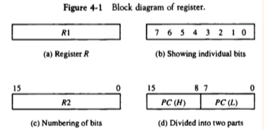

### 레지스터 전송 (Register Transfer)

- 레지스터 정보 전송

  - 치환 연산자 사용 
    - R2 <- R1                 - R1을 R2로 치환

  - 제어 조건이 있을 경우
    - If (P=1) then (R2 <- R1)

  - 제어 함수로 표현할 경우
    - P : R2 <- R1           - R2에는 t+1 타이밍에 전송 완료

  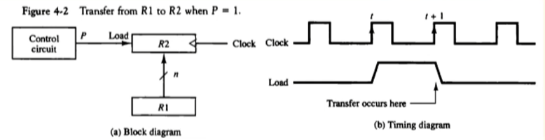

- 레지스터 전송의 기본 기호

  - Register data exchange
    - T: R2 <- R1, R1 <- R2    - T가 1일 경우 R1, R2의 값을 교환

  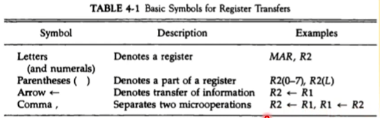

### 버스와 메모리 전송 (Bus and Memory Transfers)

- 공통 버스(Common Bus)

  - 레지스터들 사이의 전송 통로 (각 장치들 사이에서 데이터를 주고 받을 때, 데이터가 지나가는 통로!)

  - 한 번에 하나의 신호만 전송하도록 제어 (두개 이상의 장치가 사용하면 신호가 충돌날 것!!)

  - 멀티플렉서를 사용하여 레지스터 선택

    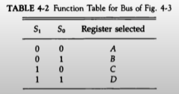

    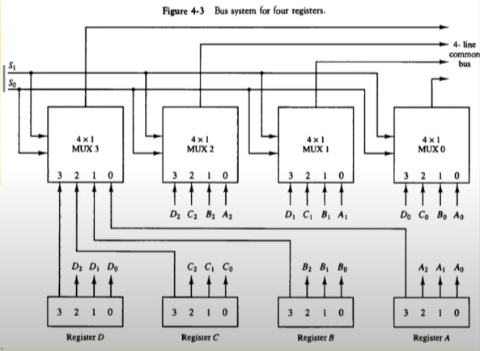

    **<버스 컨트롤러>** (보통 칩셋에 있음)

    레지스터 전송문으로 표현 예)

    ​		BUS <- C, R1 <- BUS         /       :EQ    R1 <- C      - 두 전송문이 같은 뜻!

    

    **3 - 상태 버퍼**

    ​	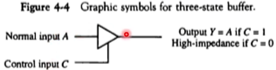

    

    - 멀티플렉서 대신 사용하여 버스 구성 가능 
    - 3개의 상태로 동작
      - 논리 0, 논리 1 : 정상적인 버퍼로 동작
      - 고저항 상태 : 출력 차단

    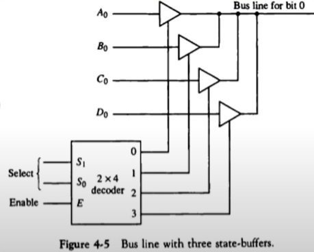

    **<3-state-Buffer를 이용하여 만든 버스 컨트롤러>**

    Read : DR <- M[AR]

    Write : M[AR] <- R1

## [제 4장 Part-2](https://www.youtube.com/watch?v=IUapFpDKhKI&list=PLc8fQ-m7b1hCHTT7VH2oo0Ng7Et096dYc&index=9)

### 산술 마이크로 연산 (Arithmetic Micro-operations)

##### 마이크로 연산의 분류

- 레지스터 전송 마이크로 연산 : 레지스터간 이진 정보 전송
- 산술 마이크로 연산 : 수치 데이터에 대한 산술 연산
- 논리 마이크로 연산 : 비수치 데이터에 대한 비트 조작 연산
- 시프트 마이크로 연산 : 데이터에 대한 시프트 연산

##### 산술 마이크로 연산

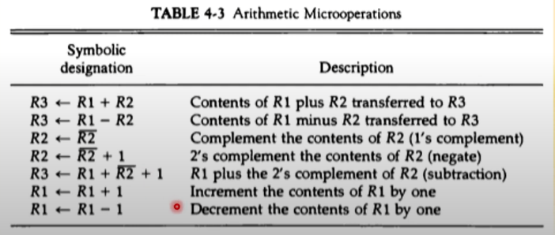

아래의 +와 -는 덧셈 뺄셈이 아니고 증감의 표현이다!

 

##### 이진 가산기

- 두 비트와 이진 캐리의 산술합을 계산

- 여러 개의 전가산기를 연결

  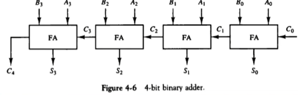

##### 이진 감가산기

- 보수를 만드는 게이트와 신호 사용

  - M -> 0 : 가산
  - M -> 1 : 감산

- A(0-3), B(0-3), S(0-3)는 bus에 연결

  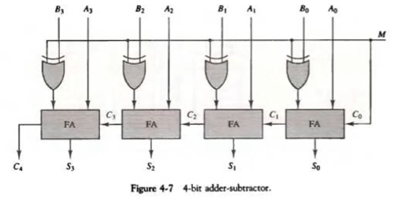

##### 산술 회로

- 4개의 전가산기

- 4개의 멀티플렉서

- 2개의 4비트 입력(A, B)

- 1개의 출력(D)

- 3개의 제어 라인(S1, S0, Cin)

  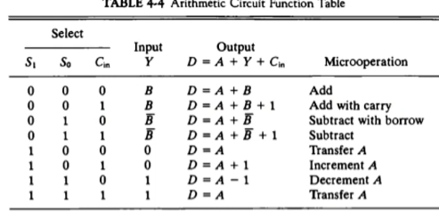

  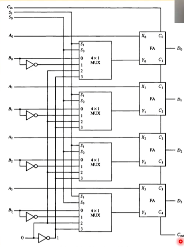

### 논리 마이크로 연산 (Logic Micro-operations)

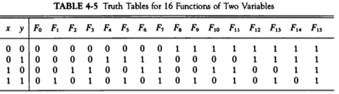

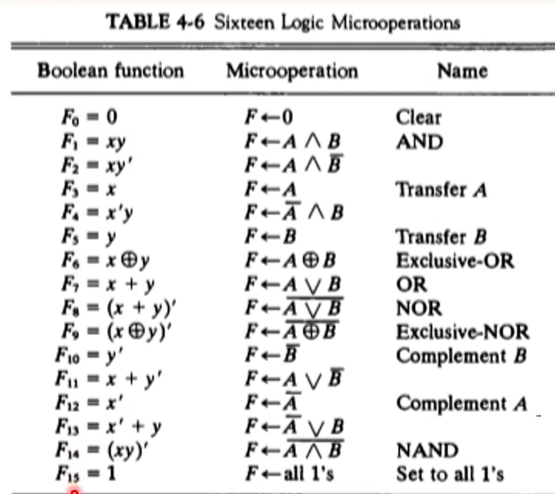

- 논리 마이크로 연산의 하드웨어 구현 (논리연산은 산술연산에 비해 간단하다!)

  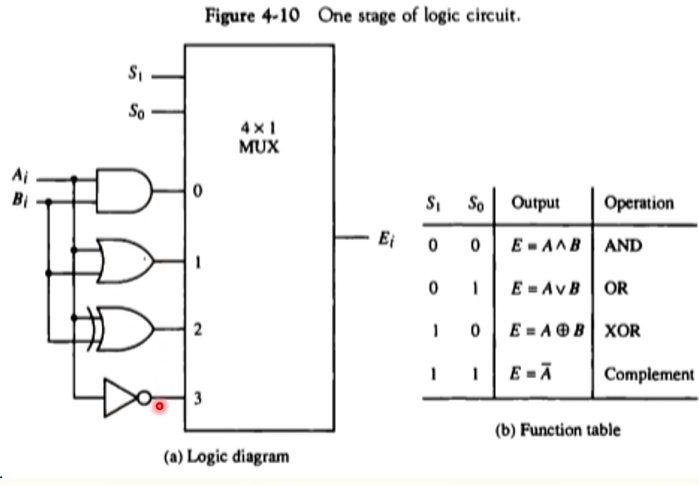

### 시프트 마이크로 연산 (Shift Micro-operations)

- 논리 시프트 (아무말 없이 시프트 라고 말하면 이를 의미함!)

  - 직렬 입력으로 **0이 전송**
    - R1 <- shl(R1)
    - R2 <- shl(R2)

- 순환 시프트

  - 직렬 출력이 직렬 입력으로 전송 (튕겨나간 비트가 비어진 공간으로 들어감!)
  - cir, cil (Circular shift-left/right)

- 산술 시프트

  - 부호 비트를 제외하고 시프트
  - 왼쪽 시프트 : *2
  - 오른쪽 시프트 : /2

- 4비트 조합회로 시프터

  - 하드웨어 구현

    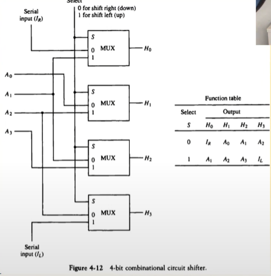

    

### 산술 논리 시프트 장치 (Arthmetic-Logic Shift Unit)

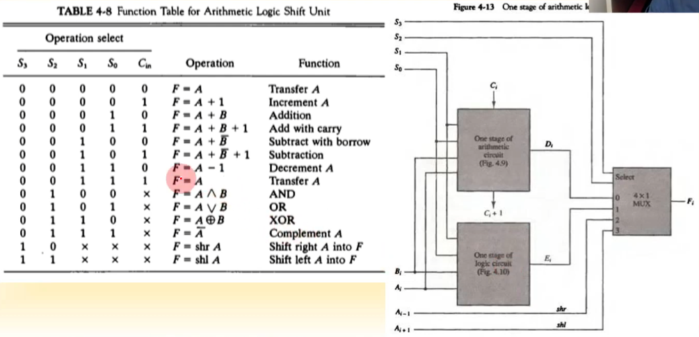