## [제 6장 Part-1](https://www.youtube.com/watch?v=bx3qZQb0LL8&list=PLc8fQ-m7b1hCHTT7VH2oo0Ng7Et096dYc&index=14)

### 기본 컴퓨터 명령어

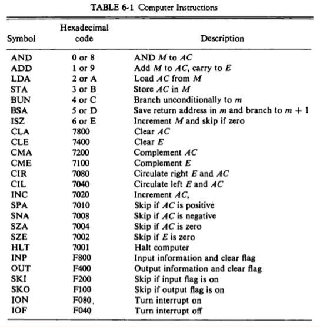

### 기계어 (Machine Language)

##### 프로그램의 종류

- 이진 코드
  - 기계어 프로그램(코드)
  - 메모리상에 실제 나타나는 형태의 명령어 집합
  - 이진 명령어와 피연산자의 시퀀스로 구성
- 8진 / 16진 코드
  - 이진 기계어 코드를 8진수, 16진수로 표현
- 기호 코드
  - 이진 기계어 코드에 대하여 문자로 심볼로 표현한다.
  - 어셈블리어
- 고급 프로그래밍 언어
  - 하드웨어 구조와 관계 없이 문제 해결 논리가 고려된 언어
  - 문제 위주의 기호화 형식 사용
  - 인터프리터, 컴파일러 사용
  - FORTRAN, PASCAL, C, C++, BASIC, Java, COBOL, ...

기계어 -> 16진 코드 -> 기호 코드 -> 어셈블리 코드 !!

### 어셈블리 언어 (Assembley Language)

##### 언어 규칙

- 라벨 필드 : 기호 주소, 또는 공란
- 명령어 필드 : 기계 명령어, 슈도 명령어
- 코멘트 필드 : 명령어에 대한 주석

##### 명령어 필드 항목

- 메모리 참조 명령어
- 레지스터 참조 명령어, 입출력 명령어
- 슈도 명령어

##### 슈도 명령어

### 어셈블러 (The Assembler)

##### 어셈블리 프로그램 예

83 - (-23) = 106

0x0053 - 0xFFE9 - 0x006A

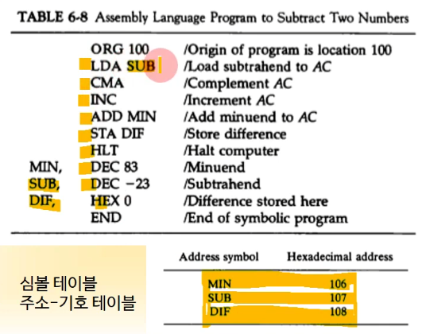

심볼과 실제 주소를 매핑해놓은 테이블이 있어야함!

##### 이진수(기계어)로의 변환

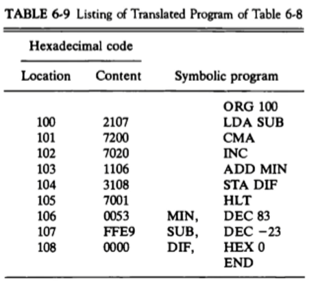

##### 어셈블러란?

어쨌든 컴퓨터는 기계어만 실행가능함. 어셈블리어는 알아듣지 못한다. 어셈블리어를 다시 이진수로 변환시켜주는 프로그램이 필요함!

- 기호-언어 프로그램을 이진 프로그램으로 번역하는 프로그램
  - MS Macro Assembler, Turbo Assembler 등
- Two pass 어셈블러(모든 어셈블러가 같은 방식이다.)
  - First pass, Second pass

##### 메모리 내에서 기호 프로그램의 표현

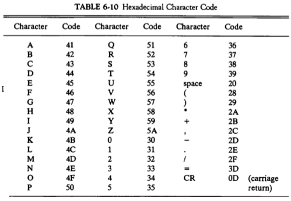

- 프로그램 예) PL3, LDA, SUB I

  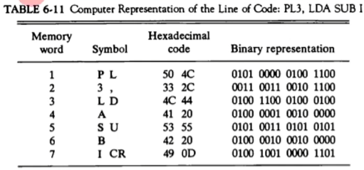

##### First pass

- 주소 기호 - 이진수 값의 관계표 작성
- Symbol Table(Address-Symbol Table)을 출력한다
- Location Counter(LC)를 사용하여 프로그램 주소 카운트

##### Second pass

- 이진수로의 번역 수행
- 4개 테이블 참조
  - MRI 명령어 Table
  - Non-MRI 명령어 Table
  - 슈도 명령어 Table
  - Symbol Table
- 출력
  - 기계어 코드

## [제 6장 Part-2](https://www.youtube.com/watch?v=hXKSCzaYCXk&list=PLc8fQ-m7b1hCHTT7VH2oo0Ng7Et096dYc&index=15)

어셈블리어 예제를 한 번 봐보자!!

### 프로그램 루프 (Program Loops)

##### 루프를 가지는 프로그램

- FORTRAN 프로그램 예

  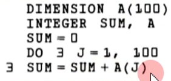

- 어셈블리어로의 표현

  - 루프 부분 / 카운터 부분 / 데이터 array 부분

  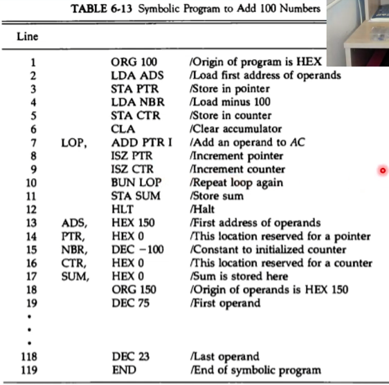

### 산술 및 논리 연산의 프로그래밍 (Programming Arithmetic and Logic Operations)

##### 곱셈 프로그램

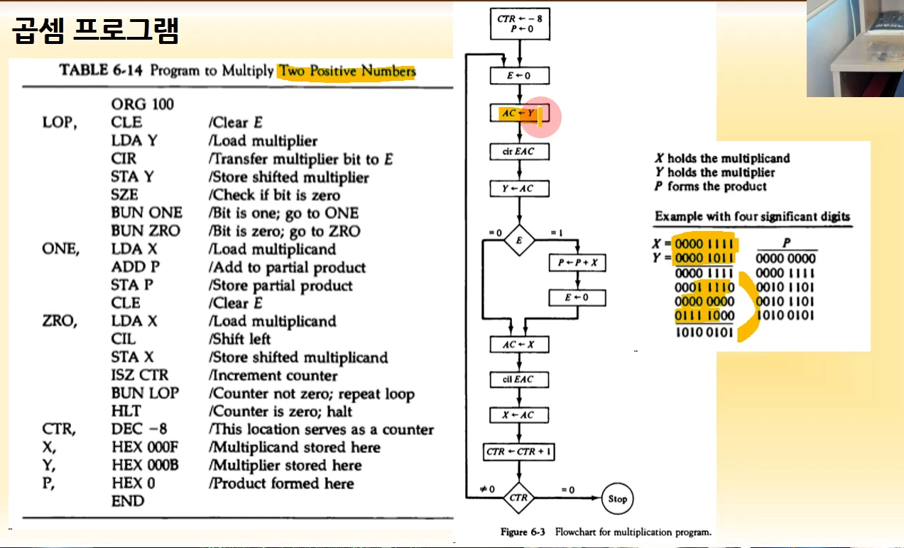

##### 배정밀도 가산

만약 컴퓨터가 16bit로 기본적인 데이터 사이즈가 16bit일 때, 데이터 사이즈가 32bit일 때는 어떻게 하느냐? -> 16bit로 위 / 아래로 나눠서 따로 계산!

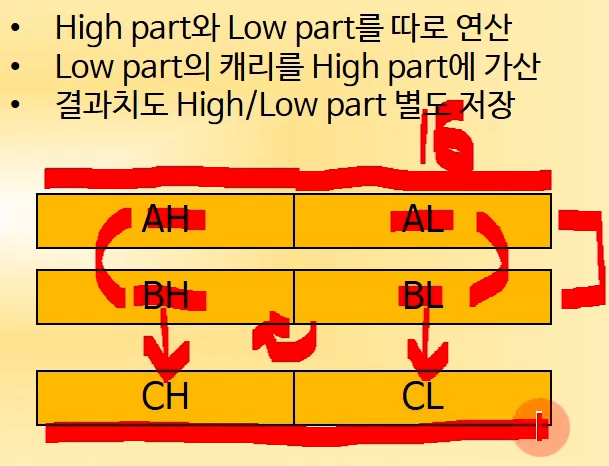

어셈블리어로 계산할 때는,

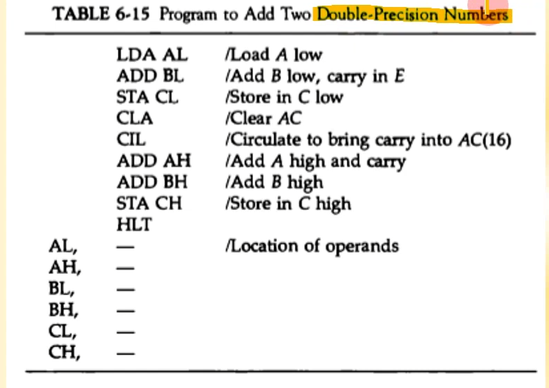

### 서브루틴 (Subroutines)

##### 서브루틴 사용 예

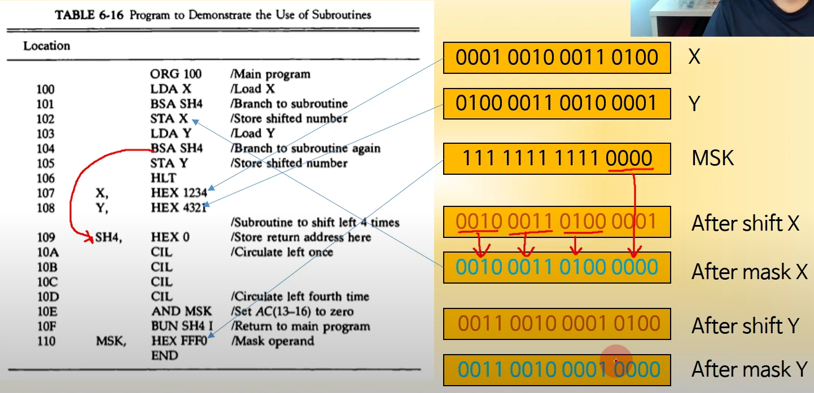

##### 서브루틴 파라미터와 데이터 링키지 (X OR Y 연산)

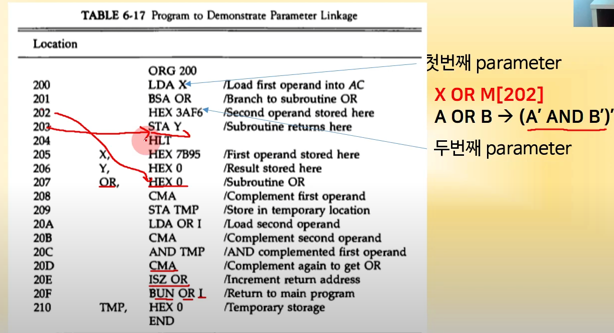

##### 16bit 데이터 블록의 복사(memcpy() 함수)

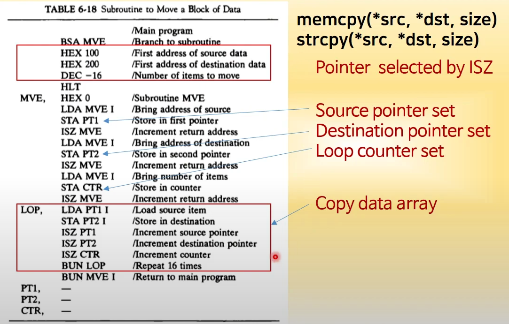

### 입출력 프로그래밍 (Input-Output Programming)

##### 1개 문자의 입출력

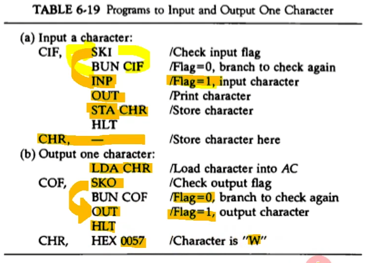

##### 2개 문자의 패킹

- 8bit ASCII -> 16bit UniCode

- SH4 서브루틴 사용

  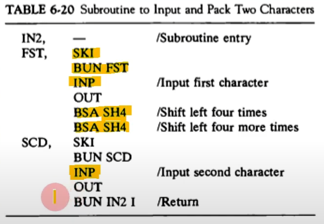

##### 버퍼에 문자 저장

##### 두 워드의 비교

- 데이터 감산을 통해 비교한다

- 결과가 0인 경우 두 워드는 동일

  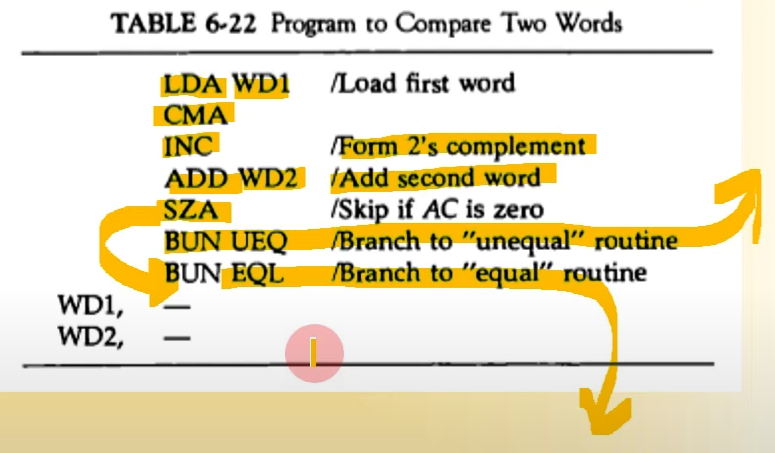

##### 프로그램 인터럽트

1) 레지스터들의 내용을 저장 (M[xx] <- REGs / IEN <- 0 (by IOFF))
2) FGI / FGO Flag들의 값 체크
3) 인터럽트 서비스 루틴 수행
4) 레지스터 내용 원상 복구 (REGs <- M[xx])
5) 인터럽트 기능 ON (IEN <- 1 (by ION))
6) 원래 프로그램으로 복귀

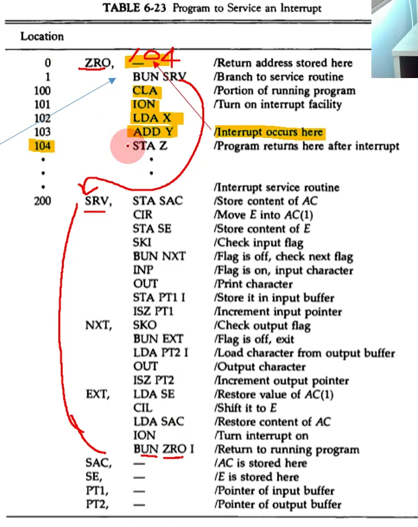
