## [제 8장 Part-1](https://www.youtube.com/watch?v=-Y2-gdesND8&list=PLc8fQ-m7b1hCHTT7VH2oo0Ng7Et096dYc&index=18)

### CPU 주요 요소

##### 기억장치

- 레지스터 집합
- 데이터 임시 저장 장소

##### 제어장치

- CPU 명령어 처리 회로의 집합
- 논리 게이트와 요소들로 구성
- 명령어에 따라서 연산 제어 수행

##### 연산장치

- ALU
- 산술 연산, 논리 연산 및 시프트 연산 수행

##### 제어장치

- CPU 명령어 처리 회로의 집합

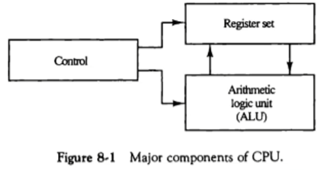

### 범용 레지스터 구조 ( General Register Organization)

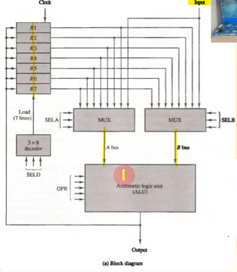

##### 공용 ALU를 가진 레지스터 집합

- 7개의 범용 레지스터
- 3 X 8 디코더 1개
- 8 X 1 MUX 2개
- ALU

##### 제어 워드 집합

- SELA, SELB : ALU 입력 결정

- SELD : ALU 출력 저장소 결정

- OPR : 연산의 종류 지정

  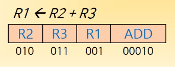

  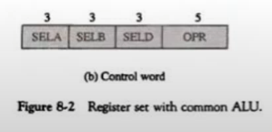

##### 레지스터와 연산 인코딩

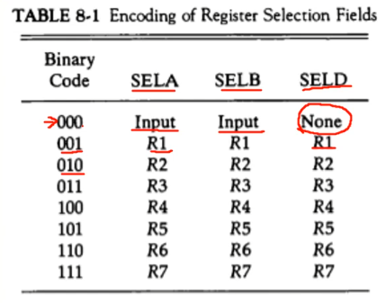

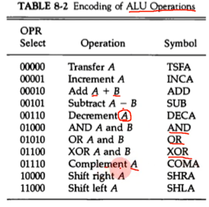

##### 마이크로 연산의 예

- R1 <- R2 - R3

  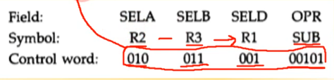

  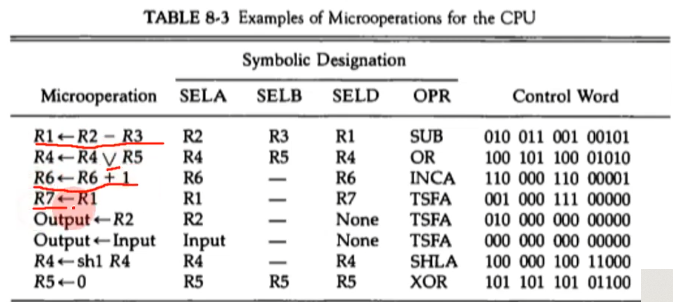

### 스택 구조 (Stack Organization)

##### 레지스터 스택

- PUSH 동작

  - SP <- SP + 1

    M[SP] <- DR

    If (SP = 0) then (FULL <- 1)

    EMPTY <- 0

    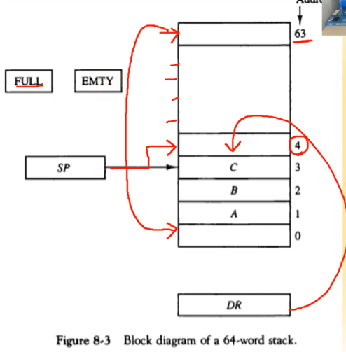

- POP 동작

  - DR <- M[SP]

    SP <- SP - 1

    If (SP = 0) then (EMPTY <- 1)

    FULL <- 0

    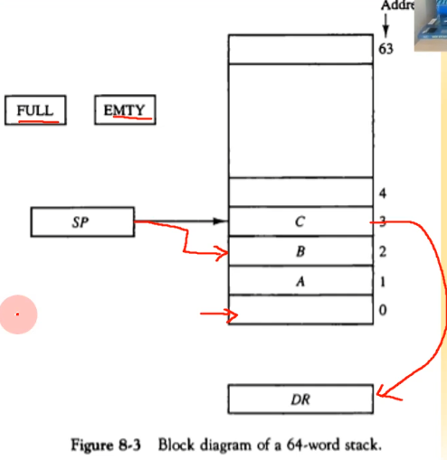

##### 메모리 스택

- PUSH 동작

  - SP <- SP - 1

    M[SP] <- DR

- POP 동작

  - DR <- M[SP]

    SP <- SP + 1

##### 메모리 세그먼트

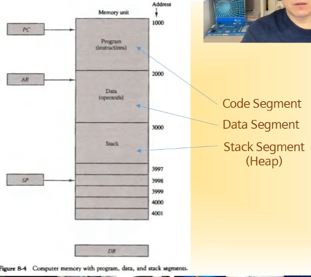

- Code/Data/Stack(Heap)
- 세그먼트의 크기
  - MS-DOS/Windows : 64KB
  - UNIX / Linux : N x 1KB 블록
- 스택 오버플로우
  - 스택의 크기를 벗어나는 SP 값
  - Protected mode에서 발생

##### 연산자 표기 방식

- Infix :  A + B
- Prefix (polish) : + A B
- Postfix (reverse polish) : A B +

##### 역 polish 표기

- A * B + C * D -> AB * CD * +

##### 스택 기반의 산술식 계산

- (3 * 4) + (5 * 6) -> 34 * 56 * +

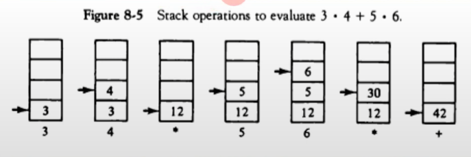

## [제 8장 Part-2](https://www.youtube.com/watch?v=uQrRlccgSs4&list=PLc8fQ-m7b1hCHTT7VH2oo0Ng7Et096dYc&index=19)

### 명령어 형식 (Instruction Format)

##### 단일 누산기 구조

모든 연산이 누산기를 중심으로 실행된다!

- ADD X

  AC <- AC + M[X]

##### 범용 레지스터 구조

- ADD R1, R2, R3     : R1 <- R2 + R3
- ADD R1, R2            : R1 <- R1 + R2
- MOV R1, R2            : R1 <- R2
- ADD R1, X               : R1 <- R1 + M[X]

##### 스택 구조

- PUSH X
- ADD

만약 X = (A + B) * (C + D) 의 명령어를 수행할때

- 3주소 명령어

  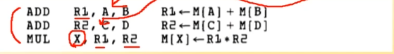

- 2주소 명령어

  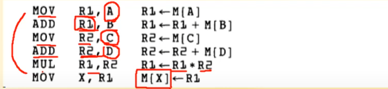

- 1주소 명령어

  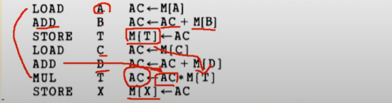

- 무주소 명령어

  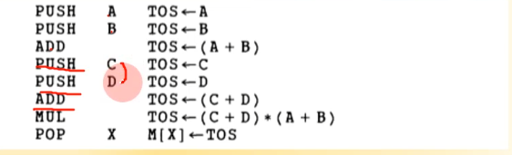

- RISC 명령어

  연산할 경우 무조건 레지스터를 끼리만 하는게 특징!!

  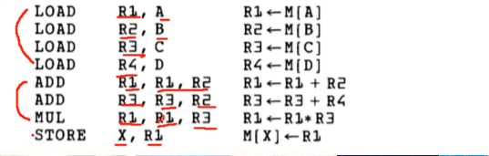

### 어드레싱 모드 (Addressing Mode)

##### 다양한 어드레싱 모드이 사용 이유

- Pointer, counter, indexing 기능 제공
- 프로그램 재배치(relocation) 편의 제공 -> 프로그래밍의 융통성 제공
- 명령어 주소 필드 최소화

##### 명령어 형식 with mode field

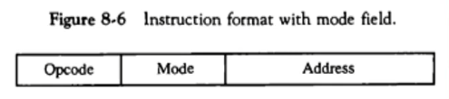

##### Implied 모두

- 피연산자가 묵시적으로 정의
- AC, E도는 스택에 피연산자 위치

##### Immediate 모드

- 피연산자가 명령어 자체에 있음
- 상수를 레지스터에 초기값으로 주는 경우 사용

##### 레지스터 (직접)모드

- CPU내 레지스터에 피연산자 존재

##### 레지스터 간접 모드

- 명령어가 피연산자 주소를 가지고 있는 레지스터를 지정
- 직접 주소보다 적은 어드레스 비트 사용

##### 자동 증가 / 자동 감소 모드

- 메모리 접근 후, 레지스터 값이 자동으로 증가 / 감소

##### 직접 주소 모드

- 명령어의 주소부분이 유효주소(EA)를 표시
- 분기 명령에서는 실제 분기 주소 표시

##### 간접 주소 모드

- 명령어 주소 부분에 유효주소를 지정하는 주소 표시
- 다양한 간접주소 모드 사용
- 유효주소의 계산 : 유효주소(EA) = 명령어 주소 부분(ADDR) + CPU 내 특정 레지스터 값

##### 상대 주소 모드

- 유효 주소 = 주소 필드값과 프로그램 카운터 값의 합 (EA = ADDR + PC)

##### 인덱스 어드레싱 모드

- 유효 주소 = 주소 필드값과 인덱스 레지스터값의 합 (EA = ADDR + XR)
- 배열(Array)의 각 원소에 대한 인덱스 주소 계산에 사용

##### 베이스 레지스터 어드레싱 몯,

- 유효주소 = 주소 필드 값과 베이스 레지스터 값의 합 (EA = ADDR + BR)
- Protected 모드의 메모리에서 세그먼트 주소 인덱싱에 사용

##### 어드레싱 모드의 실제 예

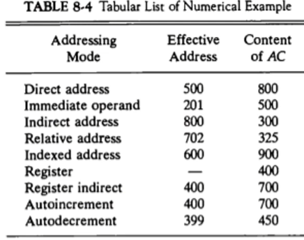

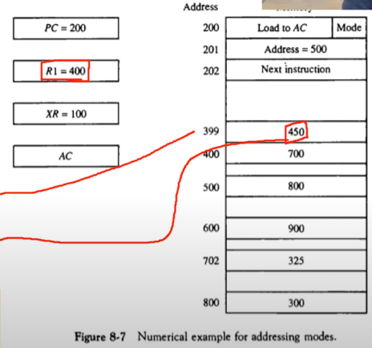

### 데이터 전송과 처리 (Data Transfer and Manipulation)

##### 데이터 전송 명령어와 주소 모드

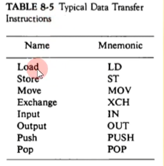

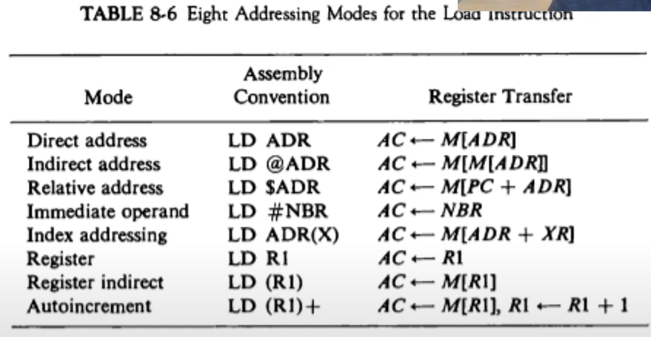

##### 데이터 처리 명령어

- 산술 명령어 

  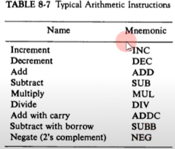

- 논리 연산 및 비트 처리 명령어

  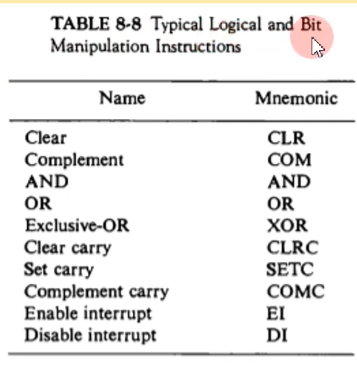

- 시프트 명령어

  

### 프로그램 제어 (Program Control)

##### 상태 비트 조건

- C : ALU 출력 캐리값
- S : AC의 부호 비트
- Z : AC 값의 zero 여부
- V : 연산 결과 오버플로우 여부

##### 상태 비트의 예

A = 1111 0000 B = 00010100 이면,

A - B : 1101 1100 이다. (C = 1, S = 1, V = 0, Z = 0)

##### 조건부 분기 명령어

- 상태 비트에 따라서 분기한다.
  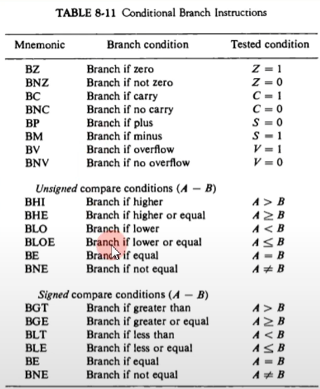

##### 서브루틴 Call

##### Return

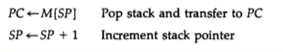

##### 순환 서브루틴(Recursive Subroutine)

- 서브루틴이 자기 자신을 호출
- 순환 Call이 return 주소를 지워버리는 것을 방지하기 위하여 스택에 return 주소를 저장

### 간소화된 명령어 집합 컴퓨터 (RISC)

-