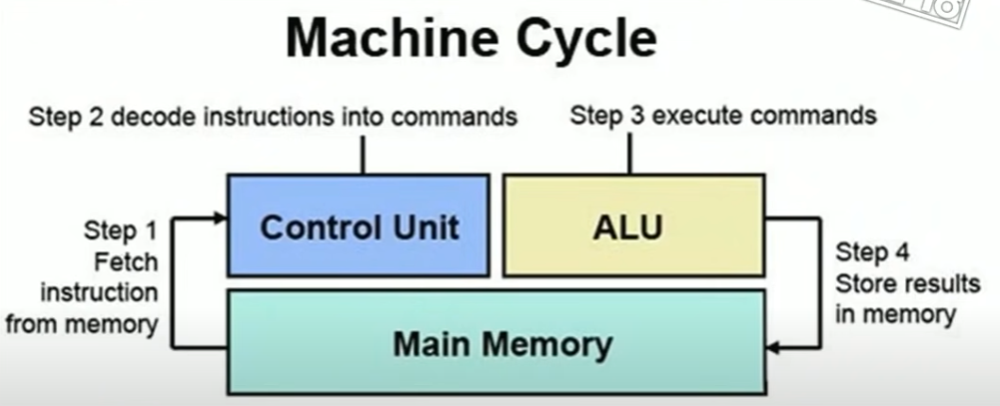
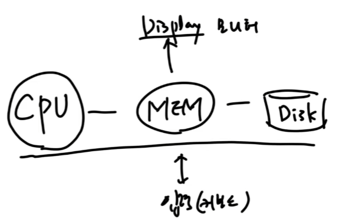

컴퓨터의 역사와 함께 현대적인 컴퓨터의 구조가 어떻게 변화되어 왔는지 가볍게 살펴보기 좋습니다.  
영상: ['컴퓨터'의 구조는 어떻게 되어있을까? CPU와 메모리! [안될과학 - 랩미팅 15화]](https://youtu.be/SiC74U8aJbM)

### 컴퓨터의 구조는 어떻게 되어있을까?

- **컴퓨터의 역사**

comput-er : 원래 수학 계산을 하는 직업을 의미 -> 현재 기계

ENIAC(1946) - 프로그래밍이 가능한 최초의 컴퓨터

- 연산처리는 가능하지만 프로그램이 따로 없었기 때문에 물리적으로 전기신호를 조종해줘야 하는 단점이 존재

 

폰노이만 : 컴퓨터의 아버지 (어떻게 컴퓨터를 만들어야 하면 되는가에 대해 방법을 적립함)

- 지금 애니악에 부족한것? -> 저장 가능한 소프트웨어가 있으면, CPU는 계산만 하면 된다!
- 계산하는 CPU + 그 정보를 저장하는 소프트웨어들 + 그 소프트웨어를 가지고 있는 하드웨어들 의 구조를 잡음

그럼 전기적인 스위치로 어떻게 컴퓨터를 만듦?(=논리 구조를 어떻게 전기적 스위칭으로 표현할 것?, 어떻게 계산을 할 것?) -> CPU에 대해 알아보자!

CPU는 여러 논리회로들로 가득차 있음 (AND, OR, XOR, NAND, NOR, XNOR 들을 조합해서 만듦) (전기 스위치로 논리를 만들 수 있다! 전기 스위치를 통해 계산을 할 수 있다!)

Jack Kilby : 현재의 작은 CPU를 만든 사람 (진공관 -> 트랜지스터 (반도체 공정으로 작은 스위치를 만들 수 있다면(전선, 저항, 다이오드 커패시터 등 각종 부품들을 반도체 공정으로 한번에 만들면)) CPU를 엄청 작게 만들 수 있지 않을까?) => Integrated Circuit(IC) : 집적회로

INTEL(1971) : 최초의 CPU

 

CPU는 정보를 기억을 하지 못함 ! -> 메모리 필요!! 

RAM (Random Acccess Memory) : 하나의 비트를 저장하기 위해 만들어짐 (1이라는 전압이 빠지지 않도록 루프)

- 용량이 커질 수록 회로가 너무 커지는 단점.. -> DRAM! 

DRAM : 훨씬 작은 부품으로 숫자 하나를 기억할 수 있게 만들어짐 **but 속도가 느림!!**

-> 작게 기억하지만 빠른 초기 RAM은 CPU안에 내장(Cache)하게 만듦!

 

RAM 메모리는 휘발설 ! 영구적인 기억 필요 !! => HDD / SSD 

그럼 RAM은 왜 필요? -> HDD / SSD는 DRAM보다 더 느림!

 

기억을 꺼냄 -> 계산 -> 기억을 넣음 : 이게 1 cycle !! => **1 clock**

 

clock이 빨라지면 빨라질 수록 성능이 좋아지지만, 발열이 너무 심해져서 한계가 존재함 

-> CPU가 2개!! (듀얼코어)

- 병렬처리가 늘리면 늘릴 수록 빨라지긴 하지만, 늘릴 수록 전시소모도 커지고 발열도 심해진다! 효율의 문제! 또한 나눠서 계산하면 검증하는 작업도 필요하기 때문에 결국 속도 향상에 한계가 있다.

 

컴퓨터-구조부터 운영체제까지 과목의 전체적인 구조를 살펴보기 좋습니다.  
영상: [컴퓨터구조 운영체제 클라우드 안쉬고 처음부터 끝까지 30분동안 설명하기. 컴퓨터-구조 처음 공부하실 때 참고하세요.](https://youtu.be/uMyKBYF48nY)

### 컴퓨터-구조 / 운영체제

- 컴퓨터 처음 공부하는 분이 뼈대로 알아놓으면 좋고 기술사, 정보처리기사 공부에도 도움이 됨

**컴퓨터의 구조**

- 하드웨어

- 운영체제

  - 프로그램(디스크에 저장되어 있는 파일) 
  - 프로세스(실행되는 파일)
  - 프로세서(CPU : 프로그램을 동작시키는 애)

  프로세스는 여러개 있는데, 이게 마치 동시에 실행되고 있는 것처럼 운영해주는 애가 운영체제!!

  

  

  

CPU개요부터.. 클라우드 컴퓨팅까지... ... 내용이 잘 이해가 안됨...